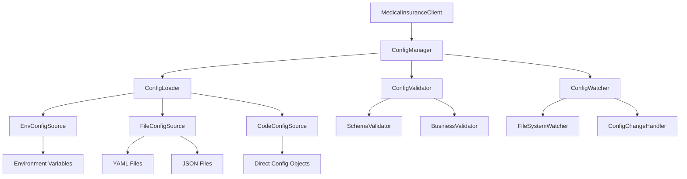

# Design Document

## Overview

本设计文档描述了医保SDK配置管理系统的增强方案。当前系统主要依赖环境变量和硬编码默认值，新的配置管理系统将提供多配置源支持、配置验证、热重载和安全处理等功能，同时保持向后兼容性。

设计的核心理念是简化用户使用体验 - 用户只需要初始化 `MedicalInsuranceClient`，所有配置管理都在内部自动处理。

## Architecture

### 配置管理架构图



### 配置优先级

1. **代码直接传入** (最高优先级)
2. **环境变量**
3. **环境特定配置文件** (如 config.prod.yaml)
4. **默认配置文件** (如 config.yaml)
5. **内置默认值** (最低优先级)

## Components and Interfaces

### 1. ConfigManager (配置管理器)

```python
class ConfigManager:
    """统一配置管理器"""
    
    def __init__(self, config_sources: List[ConfigSource] = None):
        """初始化配置管理器"""
    
    def load_config(self, config_class: Type[BaseConfig]) -> BaseConfig:
        """加载并合并配置"""
    
    def reload_config(self) -> bool:
        """重新加载配置"""
    
    def watch_config_changes(self, callback: Callable) -> None:
        """监听配置变更"""
    
    def get_config_info(self) -> Dict[str, Any]:
        """获取配置信息和来源"""
```

### 2. ConfigSource (配置源接口)

```python
class ConfigSource(ABC):
    """配置源抽象基类"""
    
    @abstractmethod
    def load(self) -> Dict[str, Any]:
        """加载配置数据"""
    
    @abstractmethod
    def is_available(self) -> bool:
        """检查配置源是否可用"""
    
    @property
    @abstractmethod
    def priority(self) -> int:
        """配置源优先级"""
    
    @property
    @abstractmethod
    def source_name(self) -> str:
        """配置源名称"""
```

### 3. 具体配置源实现

#### EnvConfigSource (环境变量配置源)
```python
class EnvConfigSource(ConfigSource):
    """环境变量配置源"""
    
    def __init__(self, prefix: str = ""):
        """初始化，支持前缀过滤"""
    
    def load(self) -> Dict[str, Any]:
        """从环境变量加载配置"""
```

#### FileConfigSource (文件配置源)
```python
class FileConfigSource(ConfigSource):
    """文件配置源"""
    
    def __init__(self, file_path: str, format: str = "auto"):
        """初始化文件配置源"""
    
    def load(self) -> Dict[str, Any]:
        """从文件加载配置"""
    
    def watch_changes(self, callback: Callable) -> None:
        """监听文件变更"""
```

### 4. ConfigValidator (配置验证器)

```python
class ConfigValidator:
    """配置验证器"""
    
    def __init__(self, schema: Dict[str, Any]):
        """初始化验证器"""
    
    def validate(self, config: Dict[str, Any]) -> ValidationResult:
        """验证配置"""
    
    def validate_partial(self, config: Dict[str, Any], keys: List[str]) -> ValidationResult:
        """部分验证配置"""
```

### 5. 增强的配置类

```python
@dataclass
class EnhancedDatabaseConfig(BaseConfig):
    """增强的数据库配置"""
    
    # 基础配置
    host: str = field(metadata={"required": True, "env": "DB_HOST"})
    port: int = field(default=3306, metadata={"env": "DB_PORT", "range": (1, 65535)})
    user: str = field(metadata={"required": True, "env": "DB_USER", "sensitive": False})
    password: str = field(metadata={"required": True, "env": "DB_PASSWORD", "sensitive": True})
    database: str = field(metadata={"required": True, "env": "DB_DATABASE"})
    
    # 连接池配置
    min_connections: int = field(default=5, metadata={"env": "DB_MIN_CONNECTIONS", "range": (1, 100)})
    max_connections: int = field(default=20, metadata={"env": "DB_MAX_CONNECTIONS", "range": (1, 1000)})
    
    @classmethod
    def get_config_schema(cls) -> Dict[str, Any]:
        """获取配置模式"""
    
    def validate_business_rules(self) -> List[str]:
        """业务规则验证"""
```

## Data Models

### 配置数据模型

```python
@dataclass
class ConfigSource:
    """配置源信息"""
    name: str
    type: str
    priority: int
    available: bool
    last_loaded: Optional[datetime]
    error: Optional[str]

@dataclass
class ConfigInfo:
    """配置信息"""
    sources: List[ConfigSource]
    merged_config: Dict[str, Any]
    validation_result: ValidationResult
    environment: str
    loaded_at: datetime

@dataclass
class ValidationResult:
    """验证结果"""
    is_valid: bool
    errors: List[str]
    warnings: List[str]
    validated_fields: List[str]
```

### 配置文件格式

#### YAML 配置示例
```yaml
# config.yaml
database:
  host: localhost
  port: 3306
  user: root
  database: medical_insurance
  
  # 连接池配置
  pool:
    min_connections: 5
    max_connections: 20
    max_usage: 1000
    
  # 超时配置
  timeouts:
    connect: 10
    read: 30
    write: 30

# 环境特定配置
environments:
  development:
    database:
      host: localhost
      database: medical_insurance_dev
      
  production:
    database:
      host: prod-db.example.com
      database: medical_insurance_prod
      pool:
        min_connections: 10
        max_connections: 50
```

## Error Handling

### 配置错误处理策略

1. **配置加载错误**
   - 记录详细错误日志
   - 尝试使用备用配置源
   - 最终回退到默认配置

2. **配置验证错误**
   - 提供详细的验证错误信息
   - 指出具体的错误字段和原因
   - 建议修复方案

3. **热重载错误**
   - 保持当前配置不变
   - 记录重载失败原因
   - 通知监听器重载失败

### 异常类设计

```python
class ConfigurationError(Exception):
    """配置错误基类"""
    pass

class ConfigLoadError(ConfigurationError):
    """配置加载错误"""
    def __init__(self, source: str, reason: str):
        self.source = source
        self.reason = reason

class ConfigValidationError(ConfigurationError):
    """配置验证错误"""
    def __init__(self, errors: List[str]):
        self.errors = errors

class ConfigReloadError(ConfigurationError):
    """配置重载错误"""
    pass
```

## Testing Strategy

### 单元测试策略

1. **配置源测试**
   - 测试各种配置源的加载功能
   - 测试配置源的优先级处理
   - 测试配置源的错误处理

2. **配置验证测试**
   - 测试配置模式验证
   - 测试业务规则验证
   - 测试错误信息的准确性

3. **配置管理器测试**
   - 测试配置合并逻辑
   - 测试热重载功能
   - 测试配置监听功能

### 集成测试策略

1. **端到端配置测试**
   - 测试从客户端初始化到配置加载的完整流程
   - 测试不同环境下的配置加载
   - 测试配置变更的影响

2. **性能测试**
   - 测试配置加载性能
   - 测试热重载性能影响
   - 测试大量配置项的处理性能

### 测试数据准备

```python
# 测试配置文件
TEST_CONFIG_YAML = """
database:
  host: test-host
  port: 3306
  user: test-user
  password: test-password
  database: test_db
"""

# 测试环境变量
TEST_ENV_VARS = {
    "DB_HOST": "env-host",
    "DB_PORT": "3307",
    "DB_USER": "env-user"
}
```

## Implementation Notes

### 向后兼容性

1. **保持现有接口**
   - `DatabaseConfig.from_env()` 方法保持不变
   - `MedicalInsuranceClient` 初始化接口保持不变
   - 现有的环境变量名称保持支持

2. **渐进式迁移**
   - 新功能作为可选特性提供
   - 逐步引导用户使用新的配置方式
   - 提供迁移工具和文档

### 性能考虑

1. **配置缓存**
   - 缓存已加载的配置避免重复解析
   - 使用懒加载减少启动时间
   - 配置变更时智能更新缓存

2. **文件监听优化**
   - 使用高效的文件系统监听机制
   - 避免频繁的文件读取操作
   - 批量处理配置变更事件

### 安全考虑

1. **敏感信息处理**
   - 自动识别敏感配置字段
   - 在日志中屏蔽敏感信息
   - 支持配置加密存储

2. **配置访问控制**
   - 限制配置文件的访问权限
   - 验证配置文件的完整性
   - 防止配置注入攻击