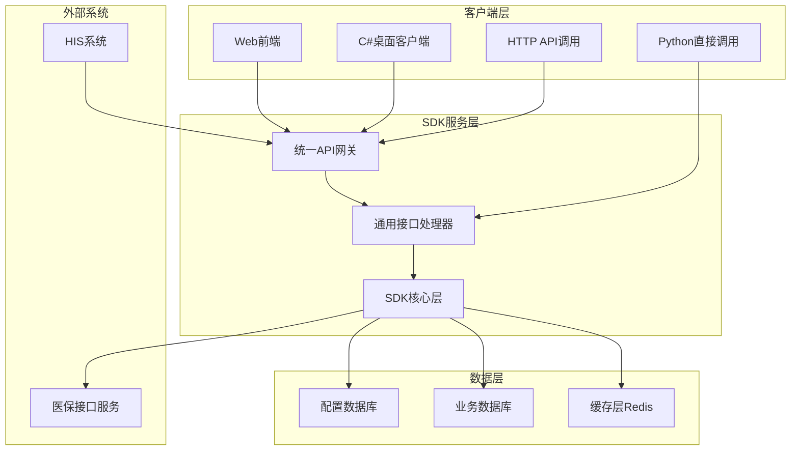

# 医保接口SDK设计文档

## 概述

本设计文档基于需求文档，详细描述了医保接口SDK的技术架构、组件设计、数据模型和实现方案。SDK采用模块化设计，支持多医院部署，同时兼容C/S和B/S架构。

## 系统架构

### 整体架构图



### 分层架构设计

#### 1. 客户端接入层
- **Python SDK**：直接调用，适用于服务端集成
- **HTTP API**：RESTful接口，适用于Web和桌面客户端
- **多语言支持**：通过HTTP API支持C#、Java等客户端

#### 2. 服务处理层
- **API网关**：统一入口，负载均衡，认证授权
- **通用处理器**：配置驱动的接口处理，支持所有医保接口
- **SDK核心**：医保接口通信核心，协议处理

#### 3. 数据存储层
- **配置数据库**：存储接口配置、机构配置等
- **业务数据库**：存储调用日志、统计数据等
- **缓存层**：Redis缓存热点数据，提升性能

## 核心组件设计

### 1. SDK核心组件 (MedicalInsuranceSDK)

```python
class MedicalInsuranceSDK:
    """医保SDK核心类"""
    
    def __init__(self, config: SDKConfig):
        self.config = config
        self.crypto_manager = CryptoManager(config.crypto_config)
        self.http_client = HTTPClient(config.http_config)
        self.config_manager = ConfigManager(config.db_config)
        self.logger = LogManager(config.log_config)
    
    def call(self, api_code: str, data: dict, **kwargs) -> MedicalInsuranceResponse:
        """统一接口调用方法"""
        org_code = kwargs.get('org_code')
        
        # 1. 数据验证（基于配置）
        validator = DataValidator(self.config_manager)
        validation_result = validator.validate_input_data(api_code, data.get('data', {}), org_code)
        
        if not validation_result.is_valid:
            raise ValidationException(
                "输入数据验证失败", 
                details={"errors": validation_result.errors}
            )
        
        # 2. 构建请求
        protocol_processor = ProtocolProcessor(self.config_manager)
        request = protocol_processor.build_request(api_code, data, org_code)
        headers = protocol_processor.build_gateway_headers(api_code, org_code)
        
        # 3. 发送请求
        org_config = self.config_manager.get_organization_config(org_code)
        response_data = self.http_client.post(
            url=org_config.base_url,
            headers=headers,
            json=request.to_dict(),
            timeout=org_config.timeout_config.get('default', 30)
        )
        
        # 4. 解析响应
        response = protocol_processor.parse_response(response_data)
        
        # 5. 记录日志
        self.logger.log_api_call(api_code, request.to_dict(), response_data, kwargs)
        
        return response
    
    def call_async(self, api_code: str, data: dict, **kwargs) -> str:
        """异步接口调用方法"""
        pass
```

**核心职责：**
- 医保接口协议处理
- 请求构建和响应解析
- 加密解密和签名验签
- 错误处理和重试机制

### 2. 配置管理组件 (ConfigManager)

```python
class ConfigManager:
    """配置管理器"""
    
    def __init__(self, db_config: DatabaseConfig):
        self.db = DatabaseManager(db_config)
        self.cache = CacheManager()
    
    def get_interface_config(self, api_code: str, region: str = None) -> InterfaceConfig:
        """获取接口配置"""
        pass
    
    def get_organization_config(self, org_code: str) -> OrganizationConfig:
        """获取机构配置"""
        pass
    
    def reload_config(self, config_type: str = None):
        """重新加载配置"""
        pass
```

**核心职责：**
- 接口配置动态加载
- 机构配置管理
- 配置缓存和热更新
- 地区差异化配置

### 3. 数据管理组件 (DataManager)

```python
class DataManager:
    """数据管理器"""
    
    def __init__(self, db_config: DatabaseConfig):
        self.db = DatabaseManager(db_config)
        self.partition_manager = PartitionManager(db_config)
    
    def save_operation_log(self, log_data: OperationLog):
        """保存操作日志"""
        pass
    
    def get_operation_logs(self, query: LogQuery) -> List[OperationLog]:
        """查询操作日志"""
        pass
    
    def get_statistics(self, stat_query: StatQuery) -> StatResult:
        """获取统计数据"""
        pass
```

**核心职责：**
- 业务数据存储
- 日志记录和查询
- 统计数据生成
- 数据分区管理

### 4. 通用接口处理器 (UniversalInterfaceProcessor)

```python
class UniversalInterfaceProcessor:
    """通用接口处理器 - 核心组件"""
    
    def __init__(self, sdk: 'MedicalInsuranceSDK'):
        self.sdk = sdk
        self.config_manager = sdk.config_manager
        self.data_parser = DataParser(sdk.config_manager)
    
    def call_interface(self, api_code: str, input_data: dict, org_code: str, **kwargs) -> dict:
        """通用接口调用方法 - 唯一的接口调用入口"""
        # 1. 获取接口配置
        interface_config = self.config_manager.get_interface_config(api_code, org_code)
        
        # 2. 数据预处理（应用默认值、数据转换等）
        processed_data = self._preprocess_input_data(input_data, interface_config)
        
        # 3. 构建请求数据
        request_data = self._build_request_data(processed_data, interface_config)
        
        # 4. 调用SDK
        response = self.sdk.call(api_code, request_data, org_code=org_code, **kwargs)
        
        # 5. 解析响应数据
        parsed_output = self._parse_response_data(response, interface_config)
        
        return parsed_output

# 通用数据处理工具类（可选）
class DataHelper:
    """数据处理辅助工具类 - 提供常用的数据处理方法"""
    
    @staticmethod
    def extract_person_basic_info(response_data: dict) -> dict:
        """提取人员基本信息的便捷方法"""
        return {
            'name': response_data.get('person_name', ''),
            'id': response_data.get('person_id', ''),
            'id_card': response_data.get('id_card', ''),
            'gender': response_data.get('gender', ''),
            'birth_date': response_data.get('birth_date', ''),
            'age': response_data.get('age', 0)
        }
    
    @staticmethod
    def extract_insurance_info(response_data: dict) -> List[dict]:
        """提取参保信息的便捷方法"""
        return response_data.get('insurance_list', [])
    
    @staticmethod
    def calculate_total_balance(insurance_list: List[dict]) -> float:
        """计算总余额的便捷方法"""
        return sum(item.get('balance', 0) for item in insurance_list)
    
    @staticmethod
    def format_settlement_summary(response_data: dict) -> dict:
        """格式化结算摘要的便捷方法"""
        return {
            'settlement_id': response_data.get('settlement_id', ''),
            'total': float(response_data.get('total_amount', 0)),
            'insurance_pay': float(response_data.get('insurance_amount', 0)),
            'personal_pay': float(response_data.get('personal_amount', 0)),
            'settlement_time': response_data.get('settlement_time', '')
        }
```

**核心职责：**
- 统一的接口调用处理
- 配置驱动的数据验证和转换
- 请求构建和响应解析
- 支持所有医保接口的通用处理

### 5. 配置驱动验证组件 (DataValidator)

```python
class DataValidator:
    """配置驱动的数据验证器"""
    
    def __init__(self, config_manager: ConfigManager):
        self.config_manager = config_manager
    
    def validate_input_data(self, api_code: str, input_data: dict, org_code: str = None) -> ValidationResult:
        """根据接口配置验证输入数据"""
        interface_config = self.config_manager.get_interface_config(api_code, org_code)
        
        validation_result = ValidationResult()
        
        # 验证必填字段
        self._validate_required_fields(input_data, interface_config.required_params, validation_result)
        
        # 验证字段格式和规则
        self._validate_field_rules(input_data, interface_config.validation_rules, validation_result)
        
        # 验证条件依赖
        self._validate_conditional_rules(input_data, interface_config.validation_rules, validation_result)
        
        return validation_result
    
    def _validate_required_fields(self, data: dict, required_params: Dict[str, Any], result: ValidationResult):
        """验证必填字段"""
        for field_name, field_config in required_params.items():
            if field_name not in data or not data[field_name]:
                result.add_error(field_name, f"{field_config.get('display_name', field_name)}不能为空")
    
    def _validate_field_rules(self, data: dict, validation_rules: Dict[str, Any], result: ValidationResult):
        """验证字段规则"""
        for field_name, field_value in data.items():
            if field_name in validation_rules:
                rules = validation_rules[field_name]
                self._apply_field_rules(field_name, field_value, rules, result)
    
    def _validate_conditional_rules(self, data: dict, validation_rules: Dict[str, Any], result: ValidationResult):
        """验证条件依赖规则"""
        conditional_rules = validation_rules.get('conditional_rules', [])
        for rule in conditional_rules:
            condition = rule.get('condition')
            if self._evaluate_condition(condition, data):
                required_fields = rule.get('required_fields', [])
                for field in required_fields:
                    if field not in data or not data[field]:
                        result.add_error(field, rule.get('error_message', f"{field}在当前条件下不能为空"))
    
    def _apply_field_rules(self, field_name: str, field_value: Any, rules: dict, result: ValidationResult):
        """应用字段验证规则"""
        # 长度验证
        if 'max_length' in rules and len(str(field_value)) > rules['max_length']:
            result.add_error(field_name, f"{field_name}长度不能超过{rules['max_length']}位")
        
        # 正则验证
        if 'pattern' in rules:
            import re
            if not re.match(rules['pattern'], str(field_value)):
                result.add_error(field_name, rules.get('pattern_error', f"{field_name}格式不正确"))
        
        # 枚举值验证
        if 'enum_values' in rules and field_value not in rules['enum_values']:
            result.add_error(field_name, f"{field_name}必须是以下值之一: {', '.join(rules['enum_values'])}")
    
    def _evaluate_condition(self, condition: dict, data: dict) -> bool:
        """评估条件表达式"""
        field = condition.get('field')
        operator = condition.get('operator')
        value = condition.get('value')
        
        if field not in data:
            return False
        
        field_value = data[field]
        
        if operator == 'eq':
            return field_value == value
        elif operator == 'in':
            return field_value in value
        elif operator == 'not_empty':
            return bool(field_value)
        
        return False

class ValidationResult:
    """验证结果"""
    
    def __init__(self):
        self.is_valid = True
        self.errors = {}
    
    def add_error(self, field: str, message: str):
        """添加错误信息"""
        self.is_valid = False
        if field not in self.errors:
            self.errors[field] = []
        self.errors[field].append(message)
    
    def get_error_messages(self) -> List[str]:
        """获取所有错误信息"""
        messages = []
        for field, field_errors in self.errors.items():
            messages.extend(field_errors)
        return messages
```

## 数据模型设计

### 1. 核心数据模型

#### 配置相关模型
```python
@dataclass
class InterfaceConfig:
    """接口配置模型"""
    api_code: str
    api_name: str
    business_category: str
    business_type: str
    required_params: Dict[str, Any]
    optional_params: Dict[str, Any]
    default_values: Dict[str, Any]
    request_template: Dict[str, Any]
    response_mapping: Dict[str, Any]
    validation_rules: Dict[str, Any]
    data_parsing_rules: Dict[str, Any]  # 新增：数据解析规则
    region_specific: Dict[str, Any]
    is_active: bool
    timeout_seconds: int
    max_retry_times: int
    
    @classmethod
    def from_db_record(cls, record: dict) -> 'InterfaceConfig':
        """从数据库记录创建配置对象"""
        import json
        return cls(
            api_code=record['api_code'],
            api_name=record['api_name'],
            business_category=record['business_category'],
            business_type=record['business_type'],
            required_params=json.loads(record['required_params']) if record['required_params'] else {},
            optional_params=json.loads(record['optional_params']) if record['optional_params'] else {},
            default_values=json.loads(record['default_values']) if record['default_values'] else {},
            request_template=json.loads(record['request_template']) if record['request_template'] else {},
            response_mapping=json.loads(record['response_mapping']) if record['response_mapping'] else {},
            validation_rules=json.loads(record['validation_rules']) if record['validation_rules'] else {},
            data_parsing_rules=json.loads(record['data_parsing_rules']) if record['data_parsing_rules'] else {},
            region_specific=json.loads(record['region_specific']) if record['region_specific'] else {},
            is_active=record['is_active'],
            timeout_seconds=record['timeout_seconds'],
            max_retry_times=record['max_retry_times']
        )

@dataclass
class OrganizationConfig:
    """机构配置模型"""
    org_code: str
    org_name: str
    org_type: str
    province_code: str
    city_code: str
    app_id: str
    app_secret: str
    base_url: str
    crypto_type: str
    sign_type: str
    timeout_config: Dict[str, int]
```

#### 业务数据模型
```python
@dataclass
class OperationLog:
    """操作日志模型"""
    operation_id: str
    api_code: str
    api_name: str
    business_category: str
    business_type: str
    institution_code: str
    psn_no: Optional[str]
    mdtrt_id: Optional[str]
    request_data: Dict[str, Any]
    response_data: Optional[Dict[str, Any]]
    status: str
    error_code: Optional[str]
    error_message: Optional[str]
    operation_time: datetime
    complete_time: Optional[datetime]
    operator_id: Optional[str]
    trace_id: str
    client_ip: str

# 注意：不再使用特定的业务数据模型类
# 所有数据都通过通用字典格式处理，具体结构由接口配置中的response_mapping决定
```

### 2. 数据库表设计

基于需求文档中的数据库设计，核心表结构包括：

1. **business_operation_logs** - 通用业务操作日志表
2. **medical_interface_config** - 接口配置表
3. **medical_organization_config** - 机构配置表
4. **medical_institution_info** - 医药机构信息表
5. **medical_interface_stats** - 接口调用统计表

详细的表结构和索引设计参见需求文档的数据库设计章节。

#### 接口配置示例数据

以人员信息获取接口(1101)为例，数据库中的配置数据：

```sql
-- medical_interface_config表中的配置示例
INSERT INTO medical_interface_config (
    api_code, api_name, business_category, business_type,
    required_params, validation_rules, default_values, 
    request_template, response_mapping, data_parsing_rules, is_active
) VALUES (
    '1101', '人员信息获取', '查询类', '人员查询',
    -- required_params: 必填参数配置
    '{
        "mdtrt_cert_type": {"display_name": "就诊凭证类型", "description": "01-电子凭证；02-身份证；03-社保卡"},
        "mdtrt_cert_no": {"display_name": "就诊凭证编号", "description": "凭证对应的编号"},
        "psn_cert_type": {"display_name": "人员证件类型", "description": "01-身份证"},
        "certno": {"display_name": "证件号码", "description": "身份证号码"},
        "psn_name": {"display_name": "人员姓名", "description": "参保人姓名"}
    }',
    -- validation_rules: 验证规则
    '{
        "mdtrt_cert_type": {
            "enum_values": ["01", "02", "03"],
            "pattern_error": "就诊凭证类型必须是01、02或03"
        },
        "mdtrt_cert_no": {
            "max_length": 50,
            "pattern": "^[A-Za-z0-9]+$",
            "pattern_error": "就诊凭证编号只能包含字母和数字"
        },
        "certno": {
            "max_length": 18,
            "pattern": "^[0-9]{17}[0-9Xx]$",
            "pattern_error": "身份证号码格式不正确"
        },
        "psn_name": {
            "max_length": 50,
            "pattern": "^[\\u4e00-\\u9fa5·]+$",
            "pattern_error": "人员姓名只能包含中文字符和·"
        },
        "conditional_rules": [
            {
                "condition": {"field": "mdtrt_cert_type", "operator": "eq", "value": "03"},
                "required_fields": ["card_sn"],
                "error_message": "使用社保卡时卡识别码不能为空"
            }
        ],
        "data_transforms": {
            "psn_name": {"type": "remove_spaces"},
            "certno": {"type": "string_upper"}
        }
    }',
    -- default_values: 默认值
    '{
        "psn_cert_type": "01",
        "begntime": ""
    }',
    -- request_template: 请求模板（可选，不配置则使用默认格式）
    '{
        "data": {
            "mdtrt_cert_type": "${mdtrt_cert_type}",
            "mdtrt_cert_no": "${mdtrt_cert_no}",
            "card_sn": "${card_sn}",
            "begntime": "${begntime}",
            "psn_cert_type": "${psn_cert_type}",
            "certno": "${certno}",
            "psn_name": "${psn_name}"
        }
    }',
    -- response_mapping: 响应数据映射规则
    '{
        "person_info": {
            "type": "direct",
            "source_path": "baseinfo"
        },
        "insurance_list": {
            "type": "array_mapping",
            "source_path": "insuinfo",
            "item_mapping": {
                "insurance_type": "insutype",
                "person_type": "psn_type",
                "balance": "balc",
                "status": "psn_insu_stas",
                "start_date": "psn_insu_date"
            }
        },
        "identity_list": {
            "type": "array_mapping",
            "source_path": "idetinfo",
            "item_mapping": {
                "identity_type": "psn_idet_type",
                "level": "psn_type_lv",
                "start_time": "begntime",
                "end_time": "endtime"
            }
        },
        "total_balance": {
            "type": "computed",
            "expression": "sum([item.get(\"balc\", 0) for item in ${insuinfo}])"
        },
        "has_insurance": {
            "type": "conditional",
            "condition": {"field": "insuinfo", "operator": "not_empty"},
            "true_rule": {"type": "direct", "source_path": "true"},
            "false_rule": {"type": "direct", "source_path": "false"}
        }
    }',
    -- data_parsing_rules: 数据解析规则
    '{
        "output_format": "structured",
        "field_mappings": {
            "person_name": "baseinfo.psn_name",
            "person_id": "baseinfo.psn_no",
            "id_card": "baseinfo.certno",
            "gender": "baseinfo.gend",
            "birth_date": "baseinfo.brdy",
            "age": "baseinfo.age"
        },
        "array_fields": {
            "insurance_info": {
                "source": "insuinfo",
                "fields": {
                    "type": "insutype",
                    "balance": "balc",
                    "status": "psn_insu_stas"
                }
            }
        },
        "computed_fields": {
            "age_group": {
                "expression": "\"儿童\" if ${baseinfo.age} < 18 else (\"青年\" if ${baseinfo.age} < 35 else (\"中年\" if ${baseinfo.age} < 60 else \"老年\"))"
            }
        }
    }',
    1
);

-- 另一个接口示例：门诊结算接口(2201)
INSERT INTO medical_interface_config (
    api_code, api_name, business_category, business_type,
    required_params, validation_rules, response_mapping, is_active
) VALUES (
    '2201', '门诊结算', '结算类', '门诊结算',
    '{
        "mdtrt_id": {"display_name": "就诊ID", "description": "医疗机构就诊ID"},
        "psn_no": {"display_name": "人员编号", "description": "医保人员编号"},
        "chrg_bchno": {"display_name": "收费批次号", "description": "收费批次号"},
        "acct_used_flag": {"display_name": "个人账户使用标志", "description": "0-不使用，1-使用"}
    }',
    '{
        "mdtrt_id": {
            "max_length": 30,
            "pattern": "^[A-Za-z0-9]+$"
        },
        "psn_no": {
            "max_length": 30,
            "pattern": "^[0-9]+$"
        },
        "acct_used_flag": {
            "enum_values": ["0", "1"]
        }
    }',
    '{
        "settlement_result": {
            "type": "direct",
            "source_path": "setlinfo"
        },
        "settlement_id": {
            "type": "direct",
            "source_path": "setlinfo.setl_id"
        },
        "total_amount": {
            "type": "direct",
            "source_path": "setlinfo.setl_totlnum"
        },
        "insurance_amount": {
            "type": "direct",
            "source_path": "setlinfo.hifp_pay"
        },
        "personal_amount": {
            "type": "direct",
            "source_path": "setlinfo.psn_pay"
        },
        "settlement_time": {
            "type": "direct",
            "source_path": "setlinfo.setl_time"
        }
    }',
    1
);
```

### 通用接口处理器的优势

通过使用通用接口处理器和配置驱动的设计，我们实现了以下优势：

#### 1. **完全配置驱动**
- **验证规则**：所有验证逻辑通过数据库配置，无需硬编码
- **数据转换**：输入数据预处理和输出数据解析完全可配置
- **请求模板**：支持自定义请求格式，适应不同接口需求
- **响应映射**：灵活的响应数据映射和结构化输出

#### 2. **高度可扩展**
- **新增接口**：只需在数据库中添加配置，无需编写代码
- **地区差异**：通过配置支持不同地区的接口差异
- **业务规则**：验证规则、数据转换规则可随时调整
- **输出格式**：响应数据格式可根据业务需要定制

#### 3. **统一处理流程**
- **标准化**：所有接口使用统一的处理流程
- **一致性**：错误处理、日志记录、监控统计保持一致
- **可维护性**：核心逻辑集中管理，易于维护和优化
- **测试友好**：通用处理器便于单元测试和集成测试

#### 4. **开发效率**
- **快速接入**：新接口接入只需配置，不需要编程
- **减少重复**：避免为每个接口编写相似的处理代码
- **配置管理**：通过管理界面可视化管理接口配置
- **版本控制**：配置变更可追踪，支持回滚

#### 5. **运维友好**
- **动态更新**：配置修改实时生效，无需重启服务
- **监控统计**：统一的调用统计和性能监控
- **问题排查**：标准化的日志格式便于问题定位
- **灰度发布**：可通过配置控制接口的启用状态

## 医保接口协议规范

### 1. 协议总览

#### 1.1 协议基础信息
- **通信协议**: HTTP/HTTPS POST
- **数据格式**: JSON
- **字符编码**: UTF-8
- **认证方式**: AK/SK + HmacSHA1签名
- **时间戳**: 13位毫秒时间戳
- **超时机制**: 签名时间戳超时30分钟

#### 1.2 接口分类
```
医保接口分类：
├── 查询类接口
│   ├── 1101 - 人员信息获取
│   ├── 1102 - 其他查询接口
│   └── ...
├── 目录下载类接口  
│   ├── 1301 - 西药中成药目录下载
│   ├── 1302 - 中药目录下载
│   ├── 1303 - 诊疗项目目录下载
│   └── 1304-1319 - 其他目录下载
├── 数据上传类接口
│   ├── 4701 - 电子病历上传
│   └── 其他业务上传接口
└── 文件传输接口
    ├── 9101 - 文件上传
    └── 9102 - 文件下载
```

### 2. 报文格式规范

#### 2.1 标准输入报文格式

```python
class MedicalInsuranceRequest:
    """医保接口标准请求格式"""
    
    def __init__(self):
        self.infno: str = ""                    # 交易编号(4位)
        self.msgid: str = ""                    # 报文ID(30位)
        self.mdtrtarea_admvs: str = ""          # 就医地医保区划(6位)
        self.insuplc_admdvs: str = ""           # 参保地医保区划(6位)
        self.recer_sys_code: str = "99"         # 接收方系统代码(10位)
        self.dev_no: str = "null"               # 设备编号(100位,可空)
        self.dev_safe_info: str = "null"        # 设备安全信息(2000位,可空)
        self.cainfo: str = "null"               # 数字签名信息(1024位,可空)
        self.signtype: str = "SM2"              # 签名类型(10位,建议SM2/SM3)
        self.infver: str = "1.0.0"              # 接口版本号(6位)
        self.opter_type: str = "1"              # 经办人类别(3位)
        self.opter: str = ""                    # 经办人(30位)
        self.opter_name: str = ""               # 经办人姓名(50位)
        self.inf_time: str = ""                 # 交易时间(19位)
        self.fixmedins_code: str = ""           # 定点医药机构编号(12位)
        self.fixmedins_name: str = ""           # 定点医药机构名称(20位)
        self.sign_no: str = "null"              # 交易签到流水号(30位,可空)
        self.input: dict = {}                   # 交易输入(40000位)

    def to_dict(self) -> dict:
        """转换为字典格式"""
        return {
            "infno": self.infno,
            "msgid": self.msgid,
            "mdtrtarea_admvs": self.mdtrtarea_admvs,
            "insuplc_admdvs": self.insuplc_admdvs,
            "recer_sys_code": self.recer_sys_code,
            "dev_no": self.dev_no,
            "dev_safe_info": self.dev_safe_info,
            "cainfo": self.cainfo,
            "signtype": self.signtype,
            "infver": self.infver,
            "opter_type": self.opter_type,
            "opter": self.opter,
            "opter_name": self.opter_name,
            "inf_time": self.inf_time,
            "fixmedins_code": self.fixmedins_code,
            "fixmedins_name": self.fixmedins_name,
            "sign_no": self.sign_no,
            "input": self.input
        }
```

#### 2.2 标准输出报文格式

```python
class MedicalInsuranceResponse:
    """医保接口标准响应格式"""
    
    def __init__(self):
        self.infcode: int = 0                   # 交易状态码：0-成功，-1-失败
        self.inf_refmsgid: str = ""             # 接收方报文ID(30位)
        self.refmsg_time: str = ""              # 接收报文时间(17位)
        self.respond_time: str = ""             # 响应报文时间(17位)
        self.err_msg: str = ""                  # 错误信息(200位)
        self.output: dict = {}                  # 交易输出(40000位)
        self.warn_msg: str = ""                 # 警告信息
        self.cainfo: str = ""                   # CA信息
        self.signtype: str = ""                 # 签名类型

    @classmethod
    def from_dict(cls, data: dict) -> 'MedicalInsuranceResponse':
        """从字典创建响应对象"""
        response = cls()
        response.infcode = data.get('infcode', -1)
        response.inf_refmsgid = data.get('inf_refmsgid', '')
        response.refmsg_time = data.get('refmsg_time', '')
        response.respond_time = data.get('respond_time', '')
        response.err_msg = data.get('err_msg', '')
        response.output = data.get('output', {})
        response.warn_msg = data.get('warn_msg', '')
        response.cainfo = data.get('cainfo', '')
        response.signtype = data.get('signtype', '')
        return response

    def is_success(self) -> bool:
        """判断是否成功"""
        return self.infcode == 0
```

### 3. 服务网关认证协议

#### 3.1 网关请求头规范

```python
class GatewayHeaders:
    """网关请求头管理"""
    
    def __init__(self, api_name: str, api_version: str, access_key: str, secret_key: str):
        self.api_name = api_name
        self.api_version = api_version
        self.access_key = access_key
        self.secret_key = secret_key
        self.timestamp = int(time.time() * 1000)
    
    def generate_headers(self) -> dict:
        """生成请求头"""
        signature = self._generate_signature()
        
        return {
            'Content-Type': 'text/plain; charset=utf-8',
            '_api_name': self.api_name,
            '_api_version': self.api_version,
            '_api_timestamp': str(self.timestamp),
            '_api_access_key': self.access_key,
            '_api_signature': signature
        }
    
    def _generate_signature(self) -> str:
        """生成签名"""
        # 1. 构建参数字典并按key排序
        params = {
            '_api_access_key': self.access_key,
            '_api_name': self.api_name,
            '_api_timestamp': str(self.timestamp),
            '_api_version': self.api_version
        }
        
        # 2. 按key自然排序并拼接
        sign_string = '&'.join([f"{k}={v}" for k, v in sorted(params.items())])
        
        # 3. HmacSHA1签名
        import hmac
        import hashlib
        import base64
        
        signature = hmac.new(
            self.secret_key.encode('utf-8'),
            sign_string.encode('utf-8'),
            hashlib.sha1
        ).digest()
        
        # 4. Base64编码
        return base64.b64encode(signature).decode('utf-8')
```

#### 3.2 签名验证和错误处理

```python
class GatewayAuthenticator:
    """网关认证器"""
    
    @staticmethod
    def verify_signature(api_name: str, api_version: str, timestamp: int, 
                        ak: str, sk: str, provided_signature: str) -> bool:
        """验证签名是否正确"""
        gateway_headers = GatewayHeaders(api_name, api_version, ak, sk)
        gateway_headers.timestamp = timestamp
        expected_signature = gateway_headers._generate_signature()
        return expected_signature == provided_signature
    
    @staticmethod
    def check_timestamp_validity(timestamp: int, max_age_minutes: int = 30) -> bool:
        """检查时间戳是否在有效期内"""
        import time
        current_timestamp = int(time.time() * 1000)
        time_diff_minutes = (current_timestamp - timestamp) / (1000 * 60)
        return time_diff_minutes <= max_age_minutes

class GatewayErrorHandler:
    """网关错误处理器"""
    
    @staticmethod
    def handle_gateway_error(response_code: int, message: str):
        """处理网关错误"""
        if response_code == 401:
            if "缺少服务网关的请求头" in message:
                raise MissingHeadersError("请求头不完整，请检查_api_*字段")
            elif "签名时间戳超时" in message:
                raise TimestampExpiredError("签名时间戳超时，请重新生成")
            elif "非法用户" in message:
                raise InvalidUserError("AK密钥无效，请检查配置")
            elif "签名不一致" in message:
                raise SignatureError("签名验证失败，请检查SK密钥和签名算法")
        
        raise UnknownGatewayError(f"网关错误: {message}")
```

### 4. 通用接口处理器

#### 4.1 通用接口调用函数

```python
class UniversalInterfaceProcessor:
    """通用接口处理器"""
    
    def __init__(self, sdk: 'MedicalInsuranceSDK'):
        self.sdk = sdk
        self.config_manager = sdk.config_manager
        self.data_parser = DataParser(sdk.config_manager)
    
    def call_interface(self, api_code: str, input_data: dict, org_code: str, **kwargs) -> dict:
        """通用接口调用方法"""
        # 1. 获取接口配置
        interface_config = self.config_manager.get_interface_config(api_code, org_code)
        
        # 2. 数据预处理（应用默认值、数据转换等）
        processed_data = self._preprocess_input_data(input_data, interface_config)
        
        # 3. 构建请求数据
        request_data = self._build_request_data(processed_data, interface_config)
        
        # 4. 调用SDK
        response = self.sdk.call(api_code, request_data, org_code=org_code, **kwargs)
        
        # 5. 解析响应数据
        parsed_output = self._parse_response_data(response, interface_config)
        
        return parsed_output
    
    def _preprocess_input_data(self, input_data: dict, interface_config: InterfaceConfig) -> dict:
        """预处理输入数据"""
        processed_data = input_data.copy()
        
        # 应用默认值
        for field, default_value in interface_config.default_values.items():
            if field not in processed_data or not processed_data[field]:
                processed_data[field] = default_value
        
        # 数据类型转换
        if 'data_transforms' in interface_config.validation_rules:
            transforms = interface_config.validation_rules['data_transforms']
            for field, transform_rule in transforms.items():
                if field in processed_data:
                    processed_data[field] = self._apply_data_transform(
                        processed_data[field], transform_rule
                    )
        
        return processed_data
    
    def _build_request_data(self, input_data: dict, interface_config: InterfaceConfig) -> dict:
        """构建请求数据"""
        if interface_config.request_template:
            # 使用模板构建请求
            return self._apply_request_template(input_data, interface_config.request_template)
        else:
            # 默认格式
            return {"data": input_data}
    
    def _parse_response_data(self, response: MedicalInsuranceResponse, 
                           interface_config: InterfaceConfig) -> dict:
        """解析响应数据"""
        if not response.is_success():
            raise BusinessException(f"接口调用失败: {response.err_msg}")
        
        # 应用响应解析规则
        if interface_config.response_mapping:
            return self.data_parser.parse_response(response.output, interface_config.response_mapping)
        else:
            return response.output
    
    def _apply_data_transform(self, value: Any, transform_rule: dict) -> Any:
        """应用数据转换规则"""
        transform_type = transform_rule.get('type')
        
        if transform_type == 'date_format':
            # 日期格式转换
            from datetime import datetime
            input_format = transform_rule.get('input_format', '%Y-%m-%d')
            output_format = transform_rule.get('output_format', '%Y-%m-%d %H:%M:%S')
            if value:
                dt = datetime.strptime(value, input_format)
                return dt.strftime(output_format)
        
        elif transform_type == 'string_upper':
            return str(value).upper() if value else value
        
        elif transform_type == 'string_lower':
            return str(value).lower() if value else value
        
        elif transform_type == 'remove_spaces':
            return str(value).replace(' ', '') if value else value
        
        return value
    
    def _apply_request_template(self, input_data: dict, template: dict) -> dict:
        """应用请求模板"""
        def replace_placeholders(obj, data):
            if isinstance(obj, dict):
                return {k: replace_placeholders(v, data) for k, v in obj.items()}
            elif isinstance(obj, list):
                return [replace_placeholders(item, data) for item in obj]
            elif isinstance(obj, str) and obj.startswith('${') and obj.endswith('}'):
                # 占位符替换
                field_name = obj[2:-1]
                return data.get(field_name, '')
            else:
                return obj
        
        return replace_placeholders(template, input_data)

class DataParser:
    """数据解析器"""
    
    def __init__(self, config_manager: ConfigManager):
        self.config_manager = config_manager
    
    def parse_response(self, response_data: dict, parsing_rules: dict) -> dict:
        """根据解析规则解析响应数据"""
        parsed_data = {}
        
        for output_field, rule in parsing_rules.items():
            parsed_data[output_field] = self._extract_field_value(response_data, rule)
        
        return parsed_data
    
    def _extract_field_value(self, data: dict, rule: dict) -> Any:
        """根据规则提取字段值"""
        rule_type = rule.get('type', 'direct')
        
        if rule_type == 'direct':
            # 直接映射
            source_path = rule.get('source_path')
            return self._get_nested_value(data, source_path)
        
        elif rule_type == 'array_mapping':
            # 数组映射
            source_path = rule.get('source_path')
            item_mapping = rule.get('item_mapping', {})
            source_array = self._get_nested_value(data, source_path)
            
            if isinstance(source_array, list):
                return [self._map_array_item(item, item_mapping) for item in source_array]
            else:
                return []
        
        elif rule_type == 'conditional':
            # 条件映射
            condition = rule.get('condition')
            if self._evaluate_condition(condition, data):
                return self._extract_field_value(data, rule.get('true_rule'))
            else:
                return self._extract_field_value(data, rule.get('false_rule'))
        
        elif rule_type == 'computed':
            # 计算字段
            expression = rule.get('expression')
            return self._evaluate_expression(expression, data)
        
        return None
    
    def _get_nested_value(self, data: dict, path: str) -> Any:
        """获取嵌套字段值"""
        if not path:
            return data
        
        keys = path.split('.')
        current = data
        
        for key in keys:
            if isinstance(current, dict) and key in current:
                current = current[key]
            else:
                return None
        
        return current
    
    def _map_array_item(self, item: dict, mapping: dict) -> dict:
        """映射数组项"""
        mapped_item = {}
        for output_key, source_key in mapping.items():
            mapped_item[output_key] = item.get(source_key)
        return mapped_item
    
    def _evaluate_condition(self, condition: dict, data: dict) -> bool:
        """评估条件"""
        field_path = condition.get('field')
        operator = condition.get('operator')
        value = condition.get('value')
        
        field_value = self._get_nested_value(data, field_path)
        
        if operator == 'eq':
            return field_value == value
        elif operator == 'ne':
            return field_value != value
        elif operator == 'in':
            return field_value in value
        elif operator == 'not_empty':
            return bool(field_value)
        
        return False
    
    def _evaluate_expression(self, expression: str, data: dict) -> Any:
        """评估计算表达式"""
        # 简单的表达式计算，可以扩展
        # 例如: "baseinfo.age * 12" 或 "len(insuinfo)"
        import re
        
        # 替换字段引用
        def replace_field_ref(match):
            field_path = match.group(1)
            value = self._get_nested_value(data, field_path)
            return str(value) if value is not None else '0'
        
        # 查找并替换字段引用 ${field.path}
        processed_expr = re.sub(r'\$\{([^}]+)\}', replace_field_ref, expression)
        
        try:
            # 安全的表达式计算（仅支持基本运算）
            allowed_names = {"len": len, "str": str, "int": int, "float": float}
            return eval(processed_expr, {"__builtins__": {}}, allowed_names)
        except:
            return None
```

### 5. 协议处理核心实现

```python
class ProtocolProcessor:
    """协议处理器"""
    
    def __init__(self, config_manager: ConfigManager):
        self.config_manager = config_manager
        self.gateway_authenticator = GatewayAuthenticator()
    
    def build_request(self, api_code: str, input_data: dict, org_code: str) -> MedicalInsuranceRequest:
        """构建标准请求"""
        org_config = self.config_manager.get_organization_config(org_code)
        interface_config = self.config_manager.get_interface_config(api_code)
        
        request = MedicalInsuranceRequest()
        request.infno = api_code
        request.msgid = self._generate_msgid(org_config.org_code)
        request.mdtrtarea_admvs = org_config.city_code
        request.insuplc_admdvs = org_config.city_code
        request.opter = org_config.operator_id or "0001"
        request.opter_name = org_config.operator_name or "系统管理员"
        request.inf_time = datetime.now().strftime("%Y-%m-%d %H:%M:%S")
        request.fixmedins_code = org_config.org_code
        request.fixmedins_name = org_config.org_name
        request.input = input_data
        
        return request
    
    def build_gateway_headers(self, api_code: str, org_code: str) -> dict:
        """构建网关请求头"""
        org_config = self.config_manager.get_organization_config(org_code)
        
        gateway_headers = GatewayHeaders(
            api_name=api_code,
            api_version="1.0.0",
            access_key=org_config.app_id,
            secret_key=org_config.app_secret
        )
        
        return gateway_headers.generate_headers()
    
    def parse_response(self, response_data: dict) -> MedicalInsuranceResponse:
        """解析响应数据"""
        return MedicalInsuranceResponse.from_dict(response_data)
    
    def _generate_msgid(self, org_code: str) -> str:
        """生成报文ID"""
        timestamp = datetime.now().strftime("%Y%m%d%H%M%S")
        sequence = str(random.randint(1000, 9999))
        return f"{org_code}{timestamp}{sequence}"
```

## 接口设计

### 1. Python SDK接口

```python
# 基础调用接口 - 基于通用处理器
class MedicalInsuranceClient:
    """医保SDK客户端 - 使用通用接口处理器"""
    
    def __init__(self, config: SDKConfig):
        self.sdk = MedicalInsuranceSDK(config)
        self.interface_processor = UniversalInterfaceProcessor(self.sdk)
    
    def call(self, api_code: str, data: dict, org_code: str, **kwargs) -> dict:
        """同步调用医保接口 - 通用方法"""
        return self.interface_processor.call_interface(api_code, data, org_code, **kwargs)
    
    def call_async(self, api_code: str, data: dict, org_code: str, **kwargs) -> str:
        """异步调用医保接口，返回操作ID"""
        operation_id = self._generate_operation_id()
        
        # 提交异步任务
        from celery import current_app
        current_app.send_task(
            'medical_insurance.process_interface_call',
            args=[operation_id, api_code, data, org_code],
            kwargs=kwargs
        )
        
        return operation_id
    
    def get_result(self, operation_id: str) -> dict:
        """获取异步调用结果"""
        # 从数据库或缓存获取结果
        result = self.sdk.data_manager.get_operation_result(operation_id)
        if result is None:
            raise OperationNotFoundError(f"操作 {operation_id} 不存在")
        return result
    
    def wait_for_result(self, operation_id: str, timeout: int = 30) -> dict:
        """等待异步调用结果"""
        import time
        start_time = time.time()
        
        while time.time() - start_time < timeout:
            try:
                result = self.get_result(operation_id)
                if result.get('status') in ['completed', 'failed']:
                    return result
            except OperationNotFoundError:
                pass
            
            time.sleep(1)  # 等待1秒后重试
        
        raise TimeoutError(f"等待操作 {operation_id} 结果超时")
    
    def _generate_operation_id(self) -> str:
        """生成操作ID"""
        import uuid
        return str(uuid.uuid4())

# 注意：不再需要单独的BusinessClient
# MedicalInsuranceClient已经提供了完全通用的接口调用能力

# 使用示例
def example_usage():
    """SDK使用示例"""
    
    # 1. 初始化配置
    config = SDKConfig(
        db_config=MySQLConfig(),
        redis_config=RedisConfig(),
        log_config=LogConfig()
    )
    
    # 2. 创建客户端
    client = MedicalInsuranceClient(config)
    
    # 3. 通用接口调用
    result = client.call("1101", {
        "mdtrt_cert_type": "02",
        "mdtrt_cert_no": "430281199001010001",
        "certno": "430281199001010001",
        "psn_name": "张三"
    }, org_code="H43111100255")
    
    # 4. 通用接口调用 - 人员信息查询
    person_info = client.call("1101", {
        "mdtrt_cert_type": "02",
        "mdtrt_cert_no": "430281199001010001",
        "certno": "430281199001010001",
        "psn_name": "张三"
    }, org_code="H43111100255")
    
    # 5. 通用接口调用 - 门诊结算
    settlement_result = client.call("2201", {
        "mdtrt_id": "M202501140001",
        "psn_no": "43000030281000120001",
        "chrg_bchno": "C202501140001",
        "acct_used_flag": "1"
    }, org_code="H43111100255")
    
    # 6. 使用数据处理工具类（可选）
    basic_info = DataHelper.extract_person_basic_info(person_info)
    insurance_list = DataHelper.extract_insurance_info(person_info)
    total_balance = DataHelper.calculate_total_balance(insurance_list)
    settlement_summary = DataHelper.format_settlement_summary(settlement_result)
    
    # 7. 异步调用
    operation_id = client.call_async("1101", {
        "mdtrt_cert_type": "02",
        "mdtrt_cert_no": "430281199001010001",
        "certno": "430281199001010001",
        "psn_name": "张三"
    }, org_code="H43111100255")
    
    # 等待结果
    async_result = client.wait_for_result(operation_id, timeout=60)
    
    print(f"人员基本信息: {basic_info}")
    print(f"参保信息: {insurance_list}")
    print(f"总余额: {total_balance}")
    print(f"结算摘要: {settlement_summary}")
    print(f"完整人员信息: {person_info}")
    print(f"完整结算结果: {settlement_result}")
    print(f"异步结果: {async_result}")
```

### 2. HTTP API接口

```yaml
# RESTful API设计
paths:
  /api/v1/medical/{api_code}:
    post:
      summary: 通用医保接口调用
      parameters:
        - name: api_code
          in: path
          required: true
          schema:
            type: string
      requestBody:
        required: true
        content:
          application/json:
            schema:
              type: object
      responses:
        200:
          description: 调用成功
          content:
            application/json:
              schema:
                $ref: '#/components/schemas/ApiResponse'

  /api/v1/person-info/{person_id}:
    get:
      summary: 查询人员医保信息
      parameters:
        - name: person_id
          in: path
          required: true
          schema:
            type: string
      responses:
        200:
          description: 查询成功
          content:
            application/json:
              schema:
                $ref: '#/components/schemas/PersonInfoResponse'

  /api/v1/settlement:
    post:
      summary: 医保结算
      requestBody:
        required: true
        content:
          application/json:
            schema:
              $ref: '#/components/schemas/SettlementRequest'
      responses:
        200:
          description: 结算成功
          content:
            application/json:
              schema:
                $ref: '#/components/schemas/SettlementResponse'
```

## 技术选型

### 1. 开发语言和框架

#### 后端技术栈
- **Python 3.8+**：主要开发语言
- **Flask/FastAPI**：Web框架，提供HTTP API
- **SQLAlchemy**：ORM框架，数据库操作
- **Celery**：异步任务处理
- **Redis**：缓存和消息队列

#### 数据库技术
- **MySQL 8.0+**：主数据库，与HIS系统保持一致，支持JSON字段和分区
- **MySQL 5.7+**：兼容版本，最低支持版本
- **Redis 6+**：缓存和会话存储

#### 加密和安全
- **cryptography**：Python加密库
- **SM3/SM4**：国密算法实现
- **JWT**：API认证令牌

### 2. 部署和运维

#### 容器化部署
- **Docker**：应用容器化
- **Docker Compose**：本地开发环境
- **Kubernetes**：生产环境编排

#### 监控和日志
- **Prometheus**：指标监控
- **Grafana**：监控面板
- **ELK Stack**：日志收集和分析

## 安全设计

### 1. 数据传输安全

```python
class CryptoManager:
    """加密管理器"""
    
    def __init__(self, crypto_config: CryptoConfig):
        self.crypto_config = crypto_config
        self.sm3_handler = SM3Handler()
        self.sm4_handler = SM4Handler()
    
    def encrypt_request(self, data: str, org_config: OrganizationConfig) -> str:
        """加密请求数据"""
        if org_config.crypto_type == 'SM4':
            return self.sm4_handler.encrypt(data, org_config.app_secret)
        else:
            return self.md5_sign(data, org_config.app_secret)
    
    def sign_request(self, data: str, org_config: OrganizationConfig) -> str:
        """签名请求数据"""
        if org_config.sign_type == 'SM3':
            return self.sm3_handler.sign(data, org_config.app_secret)
        else:
            return self.md5_sign(data, org_config.app_secret)
```

### 2. 访问控制

```python
class AuthManager:
    """认证管理器"""
    
    def authenticate_request(self, request: Request) -> AuthResult:
        """请求认证"""
        # API Key认证
        api_key = request.headers.get('X-API-Key')
        if not self.validate_api_key(api_key):
            raise AuthenticationError("Invalid API key")
        
        # IP白名单检查
        client_ip = request.remote_addr
        if not self.check_ip_whitelist(client_ip, api_key):
            raise AuthenticationError("IP not in whitelist")
        
        return AuthResult(authenticated=True, org_code=self.get_org_by_api_key(api_key))
```

### 3. 数据脱敏

```python
class DataMasker:
    """数据脱敏器"""
    
    def mask_sensitive_data(self, data: dict) -> dict:
        """脱敏敏感数据"""
        masked_data = data.copy()
        
        # 身份证号脱敏
        if 'psn_no' in masked_data:
            masked_data['psn_no'] = self.mask_id_card(masked_data['psn_no'])
        
        # 手机号脱敏
        if 'tel' in masked_data:
            masked_data['tel'] = self.mask_phone(masked_data['tel'])
        
        return masked_data
    
    def mask_id_card(self, id_card: str) -> str:
        """身份证号脱敏"""
        if len(id_card) >= 10:
            return id_card[:6] + '****' + id_card[-4:]
        return '****'
```

## 性能优化设计

### 1. 缓存策略

```python
class CacheManager:
    """缓存管理器"""
    
    def __init__(self, redis_config: RedisConfig):
        self.redis = Redis(**redis_config.to_dict())
        self.default_ttl = 3600  # 1小时
    
    def get_interface_config(self, api_code: str) -> Optional[InterfaceConfig]:
        """获取接口配置（带缓存）"""
        cache_key = f"interface_config:{api_code}"
        cached_data = self.redis.get(cache_key)
        
        if cached_data:
            return InterfaceConfig.from_json(cached_data)
        
        # 从数据库加载
        config = self.db.get_interface_config(api_code)
        if config:
            self.redis.setex(cache_key, self.default_ttl, config.to_json())
        
        return config
    
    def invalidate_config_cache(self, api_code: str = None):
        """失效配置缓存"""
        if api_code:
            self.redis.delete(f"interface_config:{api_code}")
        else:
            # 清空所有配置缓存
            keys = self.redis.keys("interface_config:*")
            if keys:
                self.redis.delete(*keys)
```

### 2. 连接池管理

```python
class ConnectionPoolManager:
    """连接池管理器"""
    
    def __init__(self, pool_config: PoolConfig):
        self.db_pool = self.create_db_pool(pool_config.db_config)
        self.redis_pool = self.create_redis_pool(pool_config.redis_config)
        self.http_pool = self.create_http_pool(pool_config.http_config)
    
    def create_db_pool(self, db_config: DatabaseConfig):
        """创建MySQL数据库连接池"""
        return create_engine(
            db_config.connection_string,
            pool_size=db_config.pool_size,
            max_overflow=db_config.max_overflow,
            pool_timeout=db_config.pool_timeout,
            pool_recycle=db_config.pool_recycle,
            # MySQL特定配置
            connect_args={
                "charset": "utf8mb4",
                "autocommit": True,
                "init_command": "SET sql_mode='STRICT_TRANS_TABLES'"
            }
        )
    
    def create_http_pool(self, http_config: HTTPConfig):
        """创建HTTP连接池"""
        return requests.Session()
```

### 3. 异步处理

```python
class AsyncProcessor:
    """异步处理器"""
    
    def __init__(self, celery_app: Celery):
        self.celery = celery_app
    
    @celery.task
    def process_medical_interface_call(self, operation_id: str, api_code: str, 
                                     data: dict, org_code: str):
        """异步处理医保接口调用"""
        try:
            # 更新状态为处理中
            self.update_operation_status(operation_id, 'processing')
            
            # 调用医保接口
            sdk = MedicalInsuranceSDK.from_org_config(org_code)
            result = sdk.call(api_code, data)
            
            # 保存结果
            self.save_operation_result(operation_id, result)
            self.update_operation_status(operation_id, 'completed')
            
        except Exception as e:
            self.save_operation_error(operation_id, str(e))
            self.update_operation_status(operation_id, 'failed')
```

## 错误处理设计

### 1. 异常层次结构

```python
class MedicalInsuranceException(Exception):
    """医保SDK基础异常"""
    def __init__(self, message: str, error_code: str = None, details: dict = None):
        super().__init__(message)
        self.error_code = error_code
        self.details = details or {}

class NetworkException(MedicalInsuranceException):
    """网络异常"""
    pass

class AuthenticationException(MedicalInsuranceException):
    """认证异常"""
    pass

class ValidationException(MedicalInsuranceException):
    """数据验证异常"""
    pass

class BusinessException(MedicalInsuranceException):
    """业务异常"""
    pass

class ConfigurationException(MedicalInsuranceException):
    """配置异常"""
    pass
```

### 2. 错误处理策略

```python
class ErrorHandler:
    """错误处理器"""
    
    def handle_exception(self, exc: Exception, context: dict) -> dict:
        """统一异常处理"""
        if isinstance(exc, NetworkException):
            return self.handle_network_error(exc, context)
        elif isinstance(exc, AuthenticationException):
            return self.handle_auth_error(exc, context)
        elif isinstance(exc, ValidationException):
            return self.handle_validation_error(exc, context)
        elif isinstance(exc, BusinessException):
            return self.handle_business_error(exc, context)
        else:
            return self.handle_unknown_error(exc, context)
    
    def handle_network_error(self, exc: NetworkException, context: dict) -> dict:
        """处理网络异常"""
        return {
            "infcode": "-1001",
            "err_msg": f"网络异常: {str(exc)}",
            "error_type": "network_error",
            "retry_suggested": True
        }
```

## 监控和日志设计

### 1. 日志设计

```python
class LogManager:
    """日志管理器"""
    
    def __init__(self, log_config: LogConfig):
        self.logger = self.setup_logger(log_config)
        self.data_manager = DataManager(log_config.db_config)
    
    def log_api_call(self, api_code: str, request_data: dict, 
                     response_data: dict, context: dict):
        """记录API调用日志"""
        log_entry = OperationLog(
            operation_id=context.get('operation_id'),
            api_code=api_code,
            api_name=context.get('api_name'),
            business_category=context.get('business_category'),
            business_type=context.get('business_type'),
            institution_code=context.get('org_code'),
            request_data=request_data,
            response_data=response_data,
            status='completed' if response_data.get('infcode') == '0' else 'failed',
            operation_time=datetime.now(),
            trace_id=context.get('trace_id'),
            client_ip=context.get('client_ip')
        )
        
        # 异步保存到数据库
        self.data_manager.save_operation_log_async(log_entry)
        
        # 记录到文件日志
        self.logger.info(f"API调用: {api_code}", extra={
            'operation_id': log_entry.operation_id,
            'org_code': log_entry.institution_code,
            'status': log_entry.status
        })
```

### 2. 监控指标

```python
class MetricsCollector:
    """指标收集器"""
    
    def __init__(self):
        self.api_call_counter = Counter('medical_api_calls_total', 
                                      'Total API calls', ['api_code', 'status'])
        self.api_duration_histogram = Histogram('medical_api_duration_seconds',
                                              'API call duration', ['api_code'])
        self.active_connections = Gauge('medical_active_connections',
                                      'Active connections')
    
    def record_api_call(self, api_code: str, duration: float, status: str):
        """记录API调用指标"""
        self.api_call_counter.labels(api_code=api_code, status=status).inc()
        self.api_duration_histogram.labels(api_code=api_code).observe(duration)
    
    def update_active_connections(self, count: int):
        """更新活跃连接数"""
        self.active_connections.set(count)
```

## 部署架构

### 1. 开发环境

```yaml
# docker-compose.dev.yml
version: '3.8'
services:
  medical-sdk:
    build: .
    ports:
      - "8080:8080"
    environment:
      - ENV=development
      - DB_HOST=mysql
      - DB_PORT=3306
      - DB_NAME=medical_insurance
      - DB_USER=medical_user
      - DB_PASSWORD=medical_password
      - REDIS_HOST=redis
    depends_on:
      - mysql
      - redis
    volumes:
      - .:/app
      - ./logs:/app/logs

  mysql:
    image: mysql:8.0
    environment:
      MYSQL_DATABASE: medical_insurance
      MYSQL_USER: medical_user
      MYSQL_PASSWORD: medical_password
      MYSQL_ROOT_PASSWORD: root_password
    ports:
      - "3306:3306"
    volumes:
      - mysql_data:/var/lib/mysql
      - ./mysql/conf.d:/etc/mysql/conf.d
    command: --default-authentication-plugin=mysql_native_password --character-set-server=utf8mb4 --collation-server=utf8mb4_unicode_ci

  redis:
    image: redis:6-alpine
    ports:
      - "6379:6379"
    volumes:
      - redis_data:/data

volumes:
  mysql_data:
  redis_data:
```

### 2. 生产环境

```yaml
# kubernetes部署配置
apiVersion: apps/v1
kind: Deployment
metadata:
  name: medical-insurance-sdk
spec:
  replicas: 3
  selector:
    matchLabels:
      app: medical-insurance-sdk
  template:
    metadata:
      labels:
        app: medical-insurance-sdk
    spec:
      containers:
      - name: medical-insurance-sdk
        image: medical-insurance-sdk:latest
        ports:
        - containerPort: 8080
        env:
        - name: ENV
          value: "production"
        - name: DB_HOST
          valueFrom:
            secretKeyRef:
              name: db-secret
              key: host
        resources:
          requests:
            memory: "256Mi"
            cpu: "250m"
          limits:
            memory: "512Mi"
            cpu: "500m"
```

## MySQL数据库优化配置

### 1. MySQL配置优化

#### 1.1 基础配置 (my.cnf)
```ini
[mysqld]
# 基础设置
default-storage-engine = InnoDB
character-set-server = utf8mb4
collation-server = utf8mb4_unicode_ci
default-authentication-plugin = mysql_native_password

# 连接设置
max_connections = 1000
max_connect_errors = 100000
wait_timeout = 28800
interactive_timeout = 28800

# InnoDB设置
innodb_buffer_pool_size = 1G
innodb_log_file_size = 256M
innodb_log_buffer_size = 16M
innodb_flush_log_at_trx_commit = 2
innodb_file_per_table = 1

# 查询缓存
query_cache_type = 1
query_cache_size = 128M
query_cache_limit = 2M

# 慢查询日志
slow_query_log = 1
slow_query_log_file = /var/log/mysql/slow.log
long_query_time = 2

# 二进制日志
log-bin = mysql-bin
binlog_format = ROW
expire_logs_days = 7
```

#### 1.2 数据库连接配置

```python
class MySQLConfig:
    """MySQL数据库配置"""
    
    def __init__(self):
        self.host = os.getenv('DB_HOST', 'localhost')
        self.port = int(os.getenv('DB_PORT', 3306))
        self.database = os.getenv('DB_NAME', 'medical_insurance')
        self.username = os.getenv('DB_USER', 'medical_user')
        self.password = os.getenv('DB_PASSWORD', 'medical_password')
        self.charset = 'utf8mb4'
        
        # 连接池配置
        self.pool_size = 20
        self.max_overflow = 30
        self.pool_timeout = 30
        self.pool_recycle = 3600
        
        # MySQL特定配置
        self.connect_args = {
            'charset': self.charset,
            'autocommit': True,
            'init_command': "SET sql_mode='STRICT_TRANS_TABLES'",
            'connect_timeout': 10,
            'read_timeout': 30,
            'write_timeout': 30
        }
    
    @property
    def connection_string(self) -> str:
        """获取数据库连接字符串"""
        return f"mysql+pymysql://{self.username}:{self.password}@{self.host}:{self.port}/{self.database}?charset={self.charset}"
```

### 2. 数据库表优化设计

#### 2.1 JSON字段使用
```sql
-- 利用MySQL 8.0的JSON字段存储复杂数据
CREATE TABLE business_operation_logs (
    id BIGINT AUTO_INCREMENT PRIMARY KEY,
    operation_id VARCHAR(50) NOT NULL UNIQUE,
    api_code VARCHAR(10) NOT NULL,
    request_data JSON NOT NULL,
    response_data JSON,
    operation_time DATETIME(3) NOT NULL,
    -- 为JSON字段创建虚拟列和索引
    psn_no VARCHAR(50) GENERATED ALWAYS AS (JSON_UNQUOTE(JSON_EXTRACT(request_data, '$.data.certno'))) STORED,
    INDEX idx_psn_no (psn_no),
    INDEX idx_json_api_code ((CAST(JSON_EXTRACT(request_data, '$.infno') AS CHAR(10))))
);
```

#### 2.2 分区表设计
```sql
-- 按月分区的日志表
CREATE TABLE business_operation_logs (
    id BIGINT AUTO_INCREMENT,
    operation_id VARCHAR(50) NOT NULL,
    operation_time DATETIME(3) NOT NULL,
    -- 其他字段...
    PRIMARY KEY (id, operation_time)
) PARTITION BY RANGE (YEAR(operation_time) * 100 + MONTH(operation_time)) (
    PARTITION p202501 VALUES LESS THAN (202502),
    PARTITION p202502 VALUES LESS THAN (202503),
    PARTITION p202503 VALUES LESS THAN (202504),
    -- 自动创建新分区的存储过程
    PARTITION p_future VALUES LESS THAN MAXVALUE
);
```

### 3. 与HIS系统集成

#### 3.1 数据库连接管理
```python
class HISIntegrationManager:
    """HIS系统集成管理器"""
    
    def __init__(self, his_db_config: MySQLConfig, sdk_db_config: MySQLConfig):
        self.his_db = create_engine(his_db_config.connection_string, **his_db_config.connect_args)
        self.sdk_db = create_engine(sdk_db_config.connection_string, **sdk_db_config.connect_args)
    
    def sync_patient_info(self, patient_id: str) -> dict:
        """从HIS系统同步患者信息"""
        with self.his_db.connect() as conn:
            result = conn.execute(
                text("SELECT * FROM patient_info WHERE patient_id = :patient_id"),
                {"patient_id": patient_id}
            )
            return dict(result.fetchone()) if result.rowcount > 0 else {}
    
    def update_medical_record(self, record_data: dict):
        """更新HIS系统的医保记录"""
        with self.his_db.connect() as conn:
            conn.execute(
                text("""
                    UPDATE medical_records 
                    SET insurance_status = :status, 
                        settlement_amount = :amount,
                        update_time = NOW()
                    WHERE record_id = :record_id
                """),
                record_data
            )
```

#### 3.2 数据同步策略
```python
class DataSyncService:
    """数据同步服务"""
    
    def __init__(self, integration_manager: HISIntegrationManager):
        self.integration_manager = integration_manager
        self.sync_queue = Queue()
    
    def sync_medical_insurance_result(self, operation_log: OperationLog):
        """同步医保结算结果到HIS系统"""
        if operation_log.api_code in ['2201', '2202']:  # 结算接口
            sync_data = self.extract_settlement_data(operation_log)
            self.integration_manager.update_medical_record(sync_data)
    
    def extract_settlement_data(self, operation_log: OperationLog) -> dict:
        """提取结算数据"""
        response_data = operation_log.response_data
        if response_data and response_data.get('infcode') == '0':
            output = response_data.get('output', {})
            return {
                'record_id': operation_log.mdtrt_id,
                'status': 'settled',
                'amount': output.get('setlinfo', {}).get('setl_totlnum', 0)
            }
        return {}
```

### 4. 性能监控和优化

#### 4.1 MySQL性能监控
```python
class MySQLMonitor:
    """MySQL性能监控"""
    
    def __init__(self, db_config: MySQLConfig):
        self.db = create_engine(db_config.connection_string)
    
    def get_connection_stats(self) -> dict:
        """获取连接统计"""
        with self.db.connect() as conn:
            result = conn.execute(text("SHOW STATUS LIKE 'Threads_%'"))
            stats = {row[0]: row[1] for row in result}
            return stats
    
    def get_slow_queries(self, limit: int = 10) -> List[dict]:
        """获取慢查询"""
        with self.db.connect() as conn:
            result = conn.execute(text("""
                SELECT query_time, lock_time, rows_sent, rows_examined, sql_text
                FROM mysql.slow_log 
                ORDER BY start_time DESC 
                LIMIT :limit
            """), {"limit": limit})
            return [dict(row) for row in result]
```

## 总结

本设计文档详细描述了医保接口SDK的技术架构和实现方案，主要特点包括：

1. **模块化设计**：清晰的分层架构，组件职责明确
2. **配置驱动**：通过数据库配置支持多医院和地区差异
3. **高性能**：缓存策略、连接池、异步处理
4. **高可用**：错误处理、重试机制、监控告警
5. **安全可靠**：加密传输、访问控制、数据脱敏
6. **易于扩展**：支持新接口快速接入，支持多种部署方式
7. **HIS集成**：与医院现有MySQL数据库系统无缝集成

设计方案充分考虑了需求文档中的所有功能和非功能性需求，特别针对MySQL数据库环境进行了优化配置，为后续的开发实施提供了详细的技术指导。