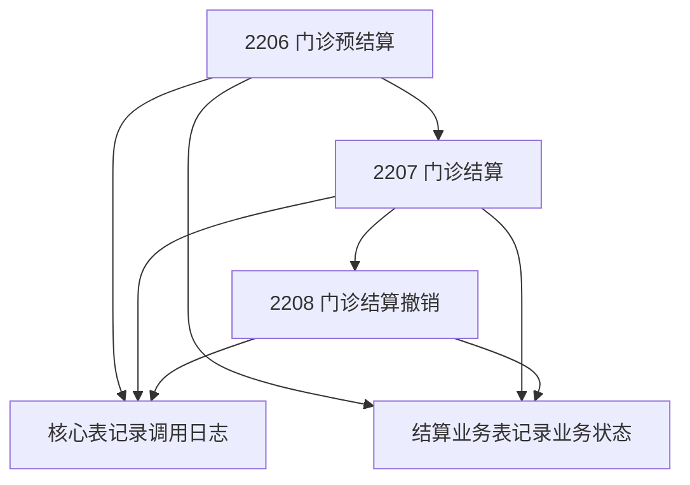
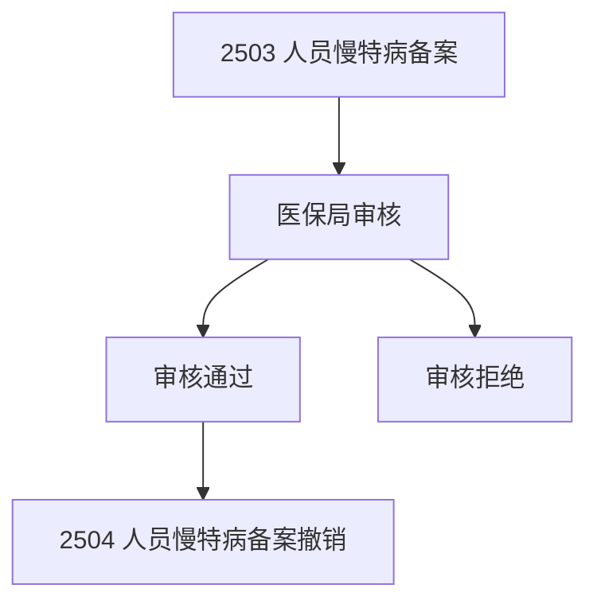

# 专项表设计思路详解

## 1. 核心思路：区分"操作记录"和"业务实体"

### 1.1 核心表的作用
`business_operation_logs` 表记录的是**操作记录**：
- 谁在什么时候调用了什么接口
- 发送了什么数据，收到了什么响应
- 调用是否成功，如果失败原因是什么

### 1.2 专项表的作用
专项表记录的是**业务实体**：
- 这个业务的当前状态是什么
- 这个业务的完整生命周期
- 这个业务的关键业务数据

## 2. 具体例子说明

### 2.1 结算业务的完整流程



**核心表记录**：
```sql
-- 每次接口调用都记录一条
INSERT INTO business_operation_logs VALUES
('OP001', '2206', '门诊预结算', '预结算请求', '预结算响应', 'success'),
('OP002', '2207', '门诊结算', '结算请求', '结算响应', 'success'),
('OP003', '2208', '门诊结算撤销', '撤销请求', '撤销响应', 'success');
```

**结算业务表记录**：
```sql
-- 一个结算业务实体，状态在变化
INSERT INTO settlement_business VALUES
('SET001', 'MDT001', 'presettlement', 150.00, 120.00); -- 预结算状态

UPDATE settlement_business SET 
    settlement_status = 'settled',
    setl_id = 'SETL001'
WHERE settlement_id = 'SET001'; -- 更新为已结算

UPDATE settlement_business SET 
    settlement_status = 'cancelled'
WHERE settlement_id = 'SET001'; -- 更新为已撤销
```

### 2.2 备案业务的完整流程



**核心表记录**：
```sql
-- 每次接口调用都记录
INSERT INTO business_operation_logs VALUES
('REG001', '2503', '人员慢特病备案', '备案请求', '备案响应', 'success'),
('REG002', '2504', '人员慢特病备案撤销', '撤销请求', '撤销响应', 'success');
```

**备案业务表记录**：
```sql
-- 一个备案业务实体，状态在变化
INSERT INTO registration_business VALUES
('REG001', 'chronic_disease', 'P12345678', 'pending'); -- 待审核

UPDATE registration_business SET 
    registration_status = 'approved',
    effective_date = '2025-01-01'
WHERE registration_id = 'REG001'; -- 审核通过

UPDATE registration_business SET 
    registration_status = 'cancelled'
WHERE registration_id = 'REG001'; -- 撤销备案
```

## 3. 哪些接口需要专项表？

### 3.1 需要专项表的接口特征
1. **有业务状态变化**：pending -> approved -> cancelled
2. **有业务实体概念**：一个结算、一个备案、一个住院记录
3. **有业务流程**：申请 -> 审核 -> 生效 -> 撤销
4. **需要业务查询**：查询某个患者的结算状态、备案情况

### 3.2 不需要专项表的接口特征
1. **纯查询操作**：5201 就诊信息查询、5202 诊断信息查询
2. **一次性操作**：9001 签到、9002 签退
3. **无状态变化**：查询完就结束，没有后续流程

## 4. 具体分析每个专项表

### 4.1 结算业务表 - 为什么需要？
```sql
-- 业务问题：
-- 1. 某个患者的结算状态是什么？
-- 2. 某笔结算的金额是多少？
-- 3. 哪些结算被撤销了？
-- 4. 某个时间段的结算统计？

SELECT 
    psn_no,
    settlement_status,
    medfee_sumamt,
    fund_pay_sumamt
FROM settlement_business 
WHERE psn_no = 'P12345678' 
AND settlement_status = 'settled';
```

### 4.2 备案业务表 - 为什么需要？
```sql
-- 业务问题：
-- 1. 某个患者有哪些有效的慢特病备案？
-- 2. 某个备案的审核状态是什么？
-- 3. 哪些备案即将过期？

SELECT 
    psn_no,
    registration_type,
    registration_status,
    effective_date,
    expiry_date
FROM registration_business 
WHERE psn_no = 'P12345678' 
AND registration_status = 'approved'
AND expiry_date > CURRENT_DATE;
```

### 4.3 查询类接口 - 为什么不需要专项表？
```sql
-- 5201 就诊信息查询
-- 这个接口只是查询操作，没有业务状态变化
-- 只需要记录调用日志即可

SELECT * FROM business_operation_logs 
WHERE api_code = '5201' 
AND psn_no = 'P12345678';
```

## 5. 重新整理专项表

基于以上分析，我重新整理专项表的必要性：

### 5.1 必要的专项表（5张）

| 专项表 | 对应业务 | 为什么需要 |
|--------|----------|------------|
| settlement_business | 结算业务 | 有结算状态、金额变化、撤销流程 |
| registration_business | 备案业务 | 有审核状态、有效期、撤销流程 |
| inpatient_business | 住院业务 | 有住院状态、入院出院流程 |
| prescription_business | 电子处方 | 有处方状态、流转过程 |
| online_payment_business | 线上支付 | 有支付状态、退费流程 |

### 5.2 可能不需要的专项表（2张）

| 专项表 | 对应业务 | 重新分析 |
|--------|----------|----------|
| information_collection_business | 信息采集 | 大多是一次性上传，可能不需要专项表 |
| inventory_business | 进销存 | 可能更适合在基础信息表中处理 |

## 6. 简化后的建表方案

### 6.1 核心表（1张）
- `business_operation_logs` - 所有174个接口的调用日志

### 6.2 专项表（5张）
- `settlement_business` - 结算业务状态管理
- `registration_business` - 备案业务状态管理  
- `inpatient_business` - 住院业务状态管理
- `prescription_business` - 电子处方业务状态管理
- `online_payment_business` - 线上支付业务状态管理

### 6.3 总计：6张表处理174个接口

## 7. 使用场景对比

### 7.1 技术监控场景
```sql
-- 查询接口调用情况 - 使用核心表
SELECT api_code, COUNT(*), AVG(duration_ms)
FROM business_operation_logs 
WHERE operation_time >= '2025-01-01'
GROUP BY api_code;
```

### 7.2 业务管理场景
```sql
-- 查询患者结算状态 - 使用专项表
SELECT settlement_id, settlement_status, medfee_sumamt
FROM settlement_business 
WHERE psn_no = 'P12345678' 
AND settlement_status = 'settled';
```

### 7.3 问题排查场景
```sql
-- 关联查询：从业务问题追踪到技术问题
SELECT 
    sb.settlement_id,
    sb.settlement_status,
    bol.error_message,
    bol.operation_time
FROM settlement_business sb
JOIN business_operation_logs bol ON sb.operation_log_id = bol.id
WHERE sb.settlement_status = 'failed';
```

## 8. 总结

专项表的核心思路是：
- **不是为了技术管理**（接口调用记录），而是为了**业务管理**（业务状态跟踪）
- **不是每个接口都需要**，只有有明确业务实体和状态流转的才需要
- **专项表和核心表是互补的**，核心表记录"操作"，专项表记录"状态"

这样设计的好处：
1. 技术监控用核心表，简单高效
2. 业务查询用专项表，语义清晰
3. 总表数量控制在6张以内，维护简单