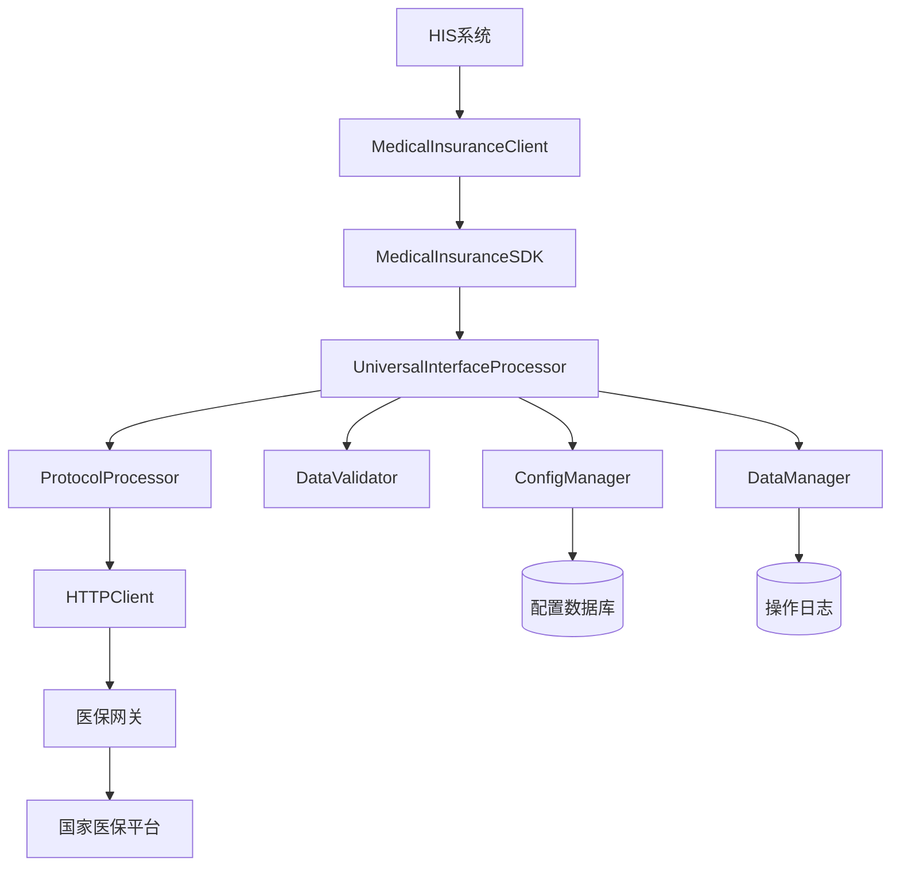

# 医保接口1101（人员信息获取）执行流程技术文档

## 文档信息

| 项目 | 内容 |
|------|------|
| 文档名称 | 医保接口1101执行流程技术文档 |
| 版本号 | v1.0 |
| 创建日期 | 2025-01-22 |
| 文档类型 | 技术规范文档 |
| 适用范围 | 医保接口SDK开发团队、HIS系统集成团队 |

## 1. 概述

### 1.1 文档目的

本文档详细描述医保接口SDK中1101接口（人员信息获取）从接收调用命令到返回结果的完整执行流程，包括数据验证、协议处理、网络通信、响应解析等各个阶段的技术细节。

### 1.2 接口简介

**1101接口**是医保系统中的基础查询接口，用于通过人员证件信息获取参保人员的基本信息和参保状态。该接口是医保业务流程的起点，为后续的医疗服务提供人员身份验证和参保信息确认。

### 1.3 系统架构概览



## 2. 技术架构组件

### 2.1 核心组件说明

| 组件名称 | 功能职责 | 文件位置 |
|---------|---------|----------|
| MedicalInsuranceClient | 客户端入口，提供简化的调用接口 | `client.py` |
| MedicalInsuranceSDK | SDK核心类，协调各组件工作 | `sdk.py` |
| UniversalInterfaceProcessor | 通用接口处理器，核心业务逻辑 | `core/universal_processor.py` |
| ConfigManager | 配置管理器，从数据库加载接口配置 | `core/config_manager.py` |
| DataValidator | 数据验证器，基于配置执行验证 | `core/validator.py` |
| ProtocolProcessor | 协议处理器，处理医保协议格式 | `core/protocol_processor.py` |
| HTTPClient | HTTP客户端，负责网络通信 | `core/http_client.py` |
| DataManager | 数据管理器，日志记录和统计 | `core/data_manager.py` |

### 2.2 数据库配置表

**medical_interface_config表** - 1101接口配置示例：

```json
{
  "api_code": "1101",
  "api_name": "人员基本信息获取",
  "business_category": "基础信息业务",
  "business_type": "query",
  "required_params": {
    "mdtrt_cert_type": {
      "display_name": "就诊凭证类型",
      "description": "01-电子凭证；02-身份证；03-社保卡"
    },
    "mdtrt_cert_no": {
      "display_name": "就诊凭证编号",
      "description": "凭证对应的编号"
    },
    "psn_cert_type": {
      "display_name": "人员证件类型",
      "description": "01-身份证"
    },
    "certno": {
      "display_name": "证件号码",
      "description": "身份证号码"
    },
    "psn_name": {
      "display_name": "人员姓名",
      "description": "参保人姓名"
    }
  },
  "validation_rules": {
    "certno": {
      "pattern": "^[0-9]{17}[0-9Xx]$",
      "pattern_error": "身份证号码格式不正确"
    },
    "mdtrt_cert_type": {
      "enum_values": ["01", "02", "03"],
      "pattern_error": "就诊凭证类型必须是01、02或03"
    },
    "psn_name": {
      "max_length": 50,
      "pattern": "^[\\u4e00-\\u9fa5·]+$",
      "pattern_error": "人员姓名只能包含中文字符和·"
    }
  },
  "response_mapping": {
    "person_name": {
      "type": "direct",
      "source_path": "baseinfo.psn_name"
    },
    "person_id": {
      "type": "direct", 
      "source_path": "baseinfo.psn_no"
    },
    "id_card": {
      "type": "direct",
      "source_path": "baseinfo.certno"
    },
    "gender": {
      "type": "transform",
      "source_path": "baseinfo.gend",
      "transform_rule": "gender_code_to_name"
    },
    "insurance_list": {
      "type": "array",
      "source_path": "insuinfo",
      "item_mapping": {
        "balance": "balc",
        "insurance_type": "insutype",
        "status": "psn_insu_stas"
      }
    }
  }
}
```

## 3. 完整执行流程

### 3.1 阶段1：客户端调用入口

**调用示例：**
```python
from medical_insurance_sdk import MedicalInsuranceClient

# 初始化客户端
client = MedicalInsuranceClient(config)

# 调用1101接口
result = client.call("1101", {
    "mdtrt_cert_type": "02",           # 身份证
    "mdtrt_cert_no": "430123199001011234",
    "psn_cert_type": "01", 
    "certno": "430123199001011234",
    "psn_name": "张三"
}, "H43010000001")  # 机构编码
```

**处理步骤：**
1. 客户端验证基本参数（api_code、org_code不能为空）
2. 调用SDK核心的call方法
3. 生成唯一的操作ID用于链路追踪

### 3.2 阶段2：SDK核心处理

**文件位置：** `medical_insurance_sdk/sdk.py`

```python
def call(self, api_code: str, data: dict, **kwargs) -> MedicalInsuranceResponse:
    org_code = kwargs.get("org_code")
    operation_id = self._generate_operation_id()
    start_time = time.time()
    
    # 委托给通用接口处理器
    response = self.universal_processor.call_interface(
        api_code="1101", 
        input_data=data, 
        org_code=org_code,
        operation_id=operation_id
    )
```

**关键职责：**
- 生成操作ID
- 记录开始时间
- 委托给UniversalInterfaceProcessor处理
- 统一异常处理和日志记录

### 3.3 阶段3：通用处理器核心流程

**文件位置：** `medical_insurance_sdk/core/universal_processor.py`

#### 3.3.1 获取接口配置

```python
def _get_interface_config(self, api_code: str, org_code: str) -> InterfaceConfig:
    # 获取机构配置以确定地区信息
    org_config = self.config_manager.get_organization_config(org_code)
    region = org_config.province_code if org_config else None
    
    # 获取接口配置
    interface_config = self.config_manager.get_interface_config(api_code, region)
```

**处理过程：**
1. 根据机构编码查询机构配置
2. 确定省份代码用于地区差异化配置
3. 从数据库或缓存获取1101接口配置
4. 返回包含验证规则、响应映射等的完整配置

#### 3.3.2 数据预处理

```python
def _preprocess_input_data(self, input_data: dict, interface_config: InterfaceConfig) -> dict:
    processed_data = input_data.copy()
    
    # 1. 应用默认值
    for field, default_value in interface_config.default_values.items():
        if field not in processed_data or processed_data[field] is None:
            processed_data[field] = default_value
    
    # 2. 数据转换
    data_transforms = interface_config.validation_rules.get('data_transforms', {})
    if data_transforms:
        processed_data = self._apply_data_transforms(processed_data, data_transforms)
    
    # 3. 数据类型转换
    processed_data = self._apply_type_conversions(processed_data, interface_config)
```

**处理内容：**
- 补充配置中定义的默认值
- 执行数据格式转换（如日期格式标准化）
- 数据类型转换（字符串转数字等）
- 数据清理和规范化

#### 3.3.3 数据验证

```python
def _validate_input_data(self, api_code: str, input_data: dict, org_code: str) -> ValidationResult:
    validation_result = self.data_validator.validate_input_data(api_code, input_data, org_code)
```

**验证项目：**

1. **必填字段验证**
   - mdtrt_cert_type（就诊凭证类型）
   - mdtrt_cert_no（就诊凭证编号）
   - psn_cert_type（人员证件类型）
   - certno（证件号码）
   - psn_name（人员姓名）

2. **格式验证**
   - 身份证号码：`^[0-9]{17}[0-9Xx]$`
   - 人员姓名：`^[\u4e00-\u9fa5·]+$`（中文字符和·）
   - 就诊凭证类型：枚举值01、02、03

3. **长度验证**
   - 人员姓名：最大50个字符
   - 就诊凭证编号：最大50个字符

4. **条件依赖验证**
   - 根据配置的conditional_rules执行
   - 例如：当凭证类型为01时，某些字段变为必填

#### 3.3.4 构建请求数据

```python
def _build_request_data(self, input_data: dict, interface_config: InterfaceConfig, org_code: str) -> dict:
    # 使用请求模板构建数据
    if interface_config.request_template:
        request_data = self._apply_request_template(input_data, interface_config.request_template)
    else:
        # 使用默认格式
        request_data = {"data": input_data}
```

**生成的标准医保请求格式：**
```json
{
  "infno": "1101",
  "msgid": "MSG202501221445001234567890123456",
  "mdtrtarea_admvs": "430100",
  "insuplc_admdvs": "430100",
  "recer_sys_code": "HIS",
  "signtype": "SM3",
  "infver": "V1.0",
  "fixmedins_code": "H43010000001",
  "fixmedins_name": "测试医院",
  "opter": "admin",
  "opter_name": "系统管理员",
  "inf_time": "2025-01-22 14:45:30",
  "input": {
    "mdtrt_cert_type": "02",
    "mdtrt_cert_no": "430123199001011234",
    "psn_cert_type": "01",
    "certno": "430123199001011234",
    "psn_name": "张三"
  }
}
```

### 3.4 阶段4：协议处理

**文件位置：** `medical_insurance_sdk/core/protocol_processor.py`

#### 3.4.1 网关认证处理

```python
def build_gateway_headers(self, api_code: str, org_code: str) -> Dict[str, str]:
    # 生成网关认证头
    gateway_headers = {
        "_api_name": api_code,
        "_api_version": "1.0.0",
        "_timestamp": int(time.time() * 1000),
        "_user_code": org_code,
        "_access_key": org_config.app_id,
        "_signature": self._generate_signature(...)
    }
```

**网关认证要素：**
- **API名称**：接口编码（1101）
- **API版本**：接口版本号（1.0.0）
- **时间戳**：当前时间毫秒数
- **用户编码**：机构编码
- **访问密钥**：AK（Access Key）
- **签名**：HMAC-SHA1签名

#### 3.4.2 签名算法

```python
def _generate_signature(self, api_name: str, api_version: str, timestamp: int, 
                       user_code: str, access_key: str, secret_key: str) -> str:
    # 1. 构建签名参数
    params = {
        '_api_name': api_name,
        '_api_version': api_version, 
        '_timestamp': str(timestamp),
        '_user_code': user_code,
        '_access_key': access_key
    }
    
    # 2. 按key自然排序并拼接
    sign_string = '&'.join([f"{k}={v}" for k, v in sorted(params.items())])
    
    # 3. HMAC-SHA1签名
    signature = hmac.new(
        secret_key.encode('utf-8'),
        sign_string.encode('utf-8'),
        hashlib.sha1
    ).digest()
    
    # 4. Base64编码
    return base64.b64encode(signature).decode('utf-8')
```

#### 3.4.3 数据加密（可选）

如果启用数据加密：
- **加密算法**：SM4对称加密
- **摘要算法**：SM3摘要
- **编码方式**：Base64编码

### 3.5 阶段5：HTTP网络请求

**文件位置：** `medical_insurance_sdk/core/http_client.py`

#### 3.5.1 HTTP请求构建

```python
def post(self, url: str, data: dict, headers: dict, **kwargs) -> dict:
    response = self.session.post(
        url=url,
        json=data,
        headers=headers,
        timeout=kwargs.get("timeout", self.timeout)
    )
    response.raise_for_status()
    return response.json()
```

**HTTP请求示例：**
```http
POST /api/medical-insurance HTTP/1.1
Host: api.medical.gov.cn
Content-Type: application/json
_api_name: 1101
_api_version: 1.0.0
_timestamp: 1737537930000
_user_code: H43010000001
_access_key: your_access_key
_signature: calculated_hmac_sha1_signature

{
  "infno": "1101",
  "msgid": "MSG202501221445001234567890123456",
  "mdtrtarea_admvs": "430100",
  "insuplc_admdvs": "430100",
  "recer_sys_code": "HIS",
  "signtype": "SM3",
  "infver": "V1.0",
  "fixmedins_code": "H43010000001",
  "fixmedins_name": "测试医院",
  "opter": "admin",
  "opter_name": "系统管理员",
  "inf_time": "2025-01-22 14:45:30",
  "input": {
    "mdtrt_cert_type": "02",
    "mdtrt_cert_no": "430123199001011234",
    "psn_cert_type": "01",
    "certno": "430123199001011234",
    "psn_name": "张三"
  }
}
```

#### 3.5.2 重试机制

```python
# 网络异常重试策略
max_retries = 3
retry_delay = [1, 2, 4]  # 指数退避

for attempt in range(max_retries):
    try:
        response = self._make_request(...)
        break
    except requests.RequestException as e:
        if attempt < max_retries - 1:
            time.sleep(retry_delay[attempt])
            continue
        else:
            raise NetworkException(f"请求失败，重试{max_retries}次后仍然失败")
```

### 3.6 阶段6：医保网关处理

#### 3.6.1 网关验证流程

1. **请求头验证**
   - 检查_api_*字段完整性
   - 验证API名称和版本号
   - 确认用户编码有效性

2. **时间戳验证**
   - 检查时间戳格式正确性
   - 验证时间戳在有效期内（通常30分钟）
   - 防止重放攻击

3. **签名验证**
   - 使用相同算法重新计算签名
   - 对比签名是否一致
   - 验证SK（Secret Key）正确性

4. **权限验证**
   - 检查机构是否有调用权限
   - 验证接口调用次数限制
   - 确认业务资质

#### 3.6.2 业务处理流程

1. **数据解密**
   - 如果启用加密，解密业务数据
   - 验证数据完整性

2. **路由处理**
   - 根据infno（1101）路由到对应处理器
   - 加载接口处理逻辑

3. **业务查询**
   - 连接国家医保数据库
   - 根据身份证号查询人员信息
   - 获取参保状态和基本信息

4. **结果封装**
   - 按标准格式封装返回数据
   - 设置正确的状态码和消息

#### 3.6.3 标准响应格式

```json
{
  "infcode": "0",
  "inf_refmsgid": "MSG202501221445001234567890123456",
  "refmsg_time": "2025-01-22 14:45:32",
  "respond_time": "2025-01-22 14:45:32",
  "err_msg": "",
  "output": {
    "baseinfo": {
      "psn_no": "43000030281000120001",
      "psn_cert_type": "01",
      "certno": "430123199001011234",
      "psn_name": "张三",
      "gend": "1",
      "naty": "01",
      "brdy": "1990-01-01",
      "age": 34,
      "ntcadrs": "湖南省长沙市",
      "poolarea": "430100"
    },
    "insuinfo": [
      {
        "balc": 1500.50,
        "insutype": "310",
        "psn_insu_stas": "1",
        "psn_type": "11"
      }
    ]
  }
}
```

### 3.7 阶段7：响应处理

#### 3.7.1 协议解析

```python
def parse_response(self, response_data: dict) -> MedicalInsuranceResponse:
    # 1. 验证响应格式
    if 'infcode' not in response_data:
        raise ProtocolException("响应格式错误：缺少infcode字段")
    
    # 2. 检查业务状态
    if response_data['infcode'] != '0':
        raise BusinessException(f"业务处理失败：{response_data.get('err_msg', '未知错误')}")
    
    # 3. 验证响应签名（如果启用）
    if self._signature_enabled:
        self._verify_response_signature(response_data)
    
    # 4. 解密响应数据（如果启用）
    if self._encryption_enabled:
        response_data = self._decrypt_response_data(response_data)
```

#### 3.7.2 数据解析映射

**文件位置：** `medical_insurance_sdk/core/data_parser.py`

```python
def parse_response(self, response_data: dict, mapping_config: dict) -> dict:
    parsed_result = {}
    
    for target_field, mapping_rule in mapping_config.items():
        if mapping_rule['type'] == 'direct':
            # 直接映射
            source_path = mapping_rule['source_path']
            parsed_result[target_field] = self._extract_nested_value(response_data, source_path)
        
        elif mapping_rule['type'] == 'transform':
            # 转换映射
            source_value = self._extract_nested_value(response_data, mapping_rule['source_path'])
            parsed_result[target_field] = self._apply_transform(source_value, mapping_rule['transform_rule'])
        
        elif mapping_rule['type'] == 'array':
            # 数组映射
            source_array = self._extract_nested_value(response_data, mapping_rule['source_path'])
            parsed_result[target_field] = self._map_array(source_array, mapping_rule['item_mapping'])
```

**解析结果示例：**
```json
{
  "person_name": "张三",
  "person_id": "43000030281000120001",
  "id_card": "430123199001011234",
  "gender": "男",
  "birth_date": "1990-01-01",
  "age": 34,
  "address": "湖南省长沙市",
  "insurance_list": [
    {
      "balance": 1500.50,
      "insurance_type": "职工基本医疗保险",
      "status": "正常参保",
      "person_type": "在职职工"
    }
  ]
}
```

### 3.8 阶段8：日志记录和统计

#### 3.8.1 操作日志记录

**文件位置：** `medical_insurance_sdk/core/data_manager.py`

```python
def save_operation_log(self, operation_log: OperationLog):
    # 构建操作日志对象
    log_entry = OperationLog(
        operation_id=operation_id,
        api_code="1101",
        org_code=org_code,
        request_time=start_time,
        response_time=end_time,
        request_data=self._mask_sensitive_data(request_data),
        response_data=self._mask_sensitive_data(response_data),
        status="success",
        duration=processing_time,
        error_message="",
        client_ip=client_ip,
        user_agent=user_agent
    )
    
    # 保存到数据库
    self._save_to_database(log_entry)
```

**敏感数据脱敏：**
- 身份证号：430123****1234
- 姓名：张*
- 手机号：138****5678

#### 3.8.2 性能统计更新

```sql
-- 更新接口调用统计
UPDATE medical_interface_stats 
SET 
    call_count = call_count + 1,
    success_count = success_count + 1,
    total_duration = total_duration + 234,
    avg_duration = total_duration / call_count,
    last_call_time = NOW()
WHERE api_code = '1101' AND org_code = 'H43010000001' AND stat_date = CURDATE();
```

### 3.9 阶段9：返回结果

#### 3.9.1 封装响应对象

```python
# 创建标准响应对象
response = MedicalInsuranceResponse(
    infcode="0",
    err_msg="",
    output=parsed_output,
    operation_id=operation_id,
    processing_time=processing_time,
    timestamp=datetime.now()
)
```

#### 3.9.2 客户端接收处理

```python
# HIS系统接收处理结果
result = client.call("1101", input_data, org_code)

if result.is_success():
    # 使用DataHelper提取标准化数据
    person_info = DataHelper.extract_person_basic_info(result.output)
    insurance_info = DataHelper.extract_insurance_info(result.output)
    total_balance = DataHelper.calculate_total_balance(insurance_info)
    
    print(f"查询成功：")
    print(f"  姓名：{person_info['name']}")
    print(f"  身份证：{person_info['id_card']}")
    print(f"  性别：{person_info['gender']}")
    print(f"  年龄：{person_info['age']}")
    print(f"  总余额：{total_balance}元")
else:
    print(f"查询失败：{result.err_msg}")
    # 可以通过operation_id查询详细错误日志
```

## 4. 性能指标分析

### 4.1 各阶段耗时统计

| 处理阶段 | 预计耗时 | 占比 | 关键操作 | 优化建议 |
|---------|---------|------|---------|----------|
| 参数验证 | 1-5ms | <1% | 正则匹配、必填检查 | 缓存编译后的正则表达式 |
| 配置查询 | 2-10ms | 2% | 数据库查询（有缓存） | Redis缓存热点配置 |
| 数据预处理 | 1-3ms | <1% | 默认值填充、类型转换 | - |
| 协议处理 | 5-20ms | 4% | 加密签名计算 | 使用硬件加速 |
| 网络传输 | 100-1000ms | 80% | HTTP请求响应 | 连接池、长连接 |
| 响应解析 | 1-5ms | 1% | JSON解析、数据映射 | 优化JSON解析器 |
| 日志记录 | 2-10ms | 2% | 数据库写入 | 异步批量写入 |
| **总耗时** | **112-1053ms** | **100%** | - | 重点优化网络层 |

### 4.2 性能优化策略

#### 4.2.1 网络层优化
- **连接池管理**：复用HTTP连接，减少建连开销
- **超时控制**：合理设置连接、读取超时时间
- **重试策略**：指数退避算法，避免雪崩效应
- **负载均衡**：多个网关地址轮询

#### 4.2.2 缓存优化
- **配置缓存**：Redis缓存接口配置，TTL=30分钟
- **签名缓存**：缓存计算结果，相同参数复用
- **连接缓存**：数据库连接池，避免频繁建连

#### 4.2.3 数据库优化
- **索引优化**：为常用查询字段建立索引
- **分区策略**：按时间分区，提高查询效率
- **读写分离**：配置查询走从库，减轻主库压力

### 4.3 并发处理能力

| 指标 | 数值 | 说明 |
|------|------|------|
| 单实例QPS | 500-1000 | 在网络正常情况下 |
| 并发连接数 | 1000 | HTTP连接池大小 |
| 数据库连接 | 50 | MySQL连接池大小 |
| Redis连接 | 20 | Redis连接池大小 |
| 内存使用 | 512MB | 单实例峰值内存 |

## 5. 异步处理流程

### 5.1 异步调用方式

```python
# 提交异步任务
task_id = client.call_async("1101", {
    "mdtrt_cert_type": "02",
    "mdtrt_cert_no": "430123199001011234",
    "psn_cert_type": "01",
    "certno": "430123199001011234",
    "psn_name": "张三"
}, "H43010000001")

print(f"任务提交成功，任务ID：{task_id}")

# 查询任务状态
status = client.get_task_status(task_id)
print(f"任务状态：{status['status']}")

# 等待结果（带超时）
try:
    result = client.wait_for_result(task_id, timeout=30)
    print(f"处理结果：{result}")
except TimeoutError:
    print("任务执行超时")
```

### 5.2 Celery任务处理

**文件位置：** `medical_insurance_sdk/async_processing/tasks.py`

```python
@celery_app.task(bind=True, max_retries=3)
def async_call_interface(self, api_code: str, input_data: dict, org_code: str, **kwargs):
    try:
        # 获取SDK实例
        sdk = get_sdk_instance()
        
        # 更新任务状态为处理中
        update_task_status(self.request.id, 'PROCESSING')
        
        # 执行接口调用
        result = sdk.call(api_code, input_data, org_code=org_code, **kwargs)
        
        # 更新任务状态为成功
        update_task_status(self.request.id, 'SUCCESS', result)
        
        return result
        
    except Exception as exc:
        # 更新任务状态为失败
        update_task_status(self.request.id, 'FAILURE', error=str(exc))
        
        # 重试逻辑
        if self.request.retries < self.max_retries:
            countdown = 2 ** self.request.retries  # 指数退避
            raise self.retry(exc=exc, countdown=countdown)
        else:
            raise exc
```

### 5.3 任务状态管理

**任务状态表：**
```sql
CREATE TABLE async_task_status (
    task_id VARCHAR(36) PRIMARY KEY,
    api_code VARCHAR(10) NOT NULL,
    org_code VARCHAR(20) NOT NULL,
    status ENUM('PENDING', 'PROCESSING', 'SUCCESS', 'FAILURE', 'RETRY') NOT NULL,
    input_data JSON,
    result_data JSON,
    error_message TEXT,
    created_at TIMESTAMP DEFAULT CURRENT_TIMESTAMP,
    updated_at TIMESTAMP DEFAULT CURRENT_TIMESTAMP ON UPDATE CURRENT_TIMESTAMP,
    INDEX idx_task_status_created (created_at),
    INDEX idx_task_status_api_org (api_code, org_code)
);
```

## 6. 错误处理和异常管理

### 6.1 异常分类体系

```python
# 自定义异常层次结构
class MedicalInsuranceException(Exception):
    """医保SDK基础异常"""
    pass

class ValidationException(MedicalInsuranceException):
    """数据验证异常"""
    def __init__(self, message: str, field_errors: Dict[str, List[str]] = None):
        super().__init__(message)
        self.field_errors = field_errors or {}

class NetworkException(MedicalInsuranceException):
    """网络异常"""
    def __init__(self, message: str, status_code: int = None):
        super().__init__(message)
        self.status_code = status_code

class BusinessException(MedicalInsuranceException):
    """业务异常"""
    def __init__(self, message: str, error_code: str = None):
        super().__init__(message)
        self.error_code = error_code

class AuthenticationException(MedicalInsuranceException):
    """认证异常"""
    pass

class ConfigurationException(MedicalInsuranceException):
    """配置异常"""
    pass
```

### 6.2 常见错误代码

| 错误代码 | 错误描述 | 处理建议 |
|----------|----------|----------|
| -1 | 系统异常 | 检查系统状态，联系技术支持 |
| -2 | 业务异常 | 检查业务数据和流程 |
| -3 | 网络异常 | 检查网络连接，稍后重试 |
| -4 | 验证异常 | 检查输入参数格式 |
| -5 | 认证异常 | 检查AK/SK配置 |
| -6 | 权限异常 | 联系管理员开通权限 |
| -7 | 限流异常 | 降低调用频率 |
| -8 | 超时异常 | 增加超时时间或检查网络 |

### 6.3 错误恢复策略

#### 6.3.1 网络异常恢复

```python
def handle_network_error(self, error: NetworkException, context: Dict[str, Any]):
    retry_count = context.get('retry_count', 0)
    max_retries = context.get('max_retries', 3)
    
    if retry_count < max_retries:
        # 指数退避重试
        delay = min(2 ** retry_count, 60)  # 最大延迟60秒
        time.sleep(delay)
        
        context['retry_count'] = retry_count + 1
        return self._retry_request(context)
    else:
        # 达到最大重试次数，记录错误并返回失败
        self.logger.error(f"网络异常重试{max_retries}次后仍然失败: {error}")
        raise error
```

#### 6.3.2 业务异常处理

```python
def handle_business_error(self, error_code: str, error_message: str) -> Dict[str, Any]:
    error_handlers = {
        '-1': self._handle_system_error,
        '-2': self._handle_business_logic_error,
        '-5': self._handle_auth_error,
        '-7': self._handle_rate_limit_error
    }
    
    handler = error_handlers.get(error_code, self._handle_unknown_error)
    return handler(error_code, error_message)
```

## 7. 配置管理

### 7.1 配置文件结构

**主配置文件：** `config/sdk_config.json`
```json
{
  "database": {
    "host": "localhost",
    "port": 3306,
    "username": "medical_sdk",
    "password": "password",
    "database": "medical_insurance_sdk",
    "pool_size": 50,
    "pool_timeout": 30
  },
  "redis": {
    "host": "localhost", 
    "port": 6379,
    "password": "",
    "db": 0,
    "pool_size": 20
  },
  "http": {
    "timeout": 30,
    "max_retries": 3,
    "pool_connections": 100,
    "pool_maxsize": 100
  },
  "logging": {
    "level": "INFO",
    "format": "%(asctime)s - %(name)s - %(levelname)s - %(message)s",
    "file_path": "logs/medical_insurance_sdk.log",
    "max_file_size": "10MB",
    "backup_count": 5
  },
  "security": {
    "encryption_enabled": true,
    "signature_enabled": true,
    "algorithm": "SM4",
    "digest_algorithm": "SM3"
  }
}
```

### 7.2 环境变量配置

```bash
# 数据库配置
export DB_HOST=localhost
export DB_PORT=3306
export DB_USERNAME=medical_sdk
export DB_PASSWORD=your_password
export DB_DATABASE=medical_insurance_sdk

# Redis配置
export REDIS_HOST=localhost
export REDIS_PORT=6379
export REDIS_PASSWORD=""
export REDIS_DB=0

# 环境配置
export ENVIRONMENT=production
export SDK_LOG_LEVEL=INFO
export SDK_DEBUG=false
```

### 7.3 机构配置管理

**medical_organization_config表结构：**
```sql
CREATE TABLE medical_organization_config (
    org_code VARCHAR(20) PRIMARY KEY COMMENT '机构编码',
    org_name VARCHAR(100) NOT NULL COMMENT '机构名称',
    org_type VARCHAR(10) NOT NULL COMMENT '机构类型',
    province_code VARCHAR(10) NOT NULL COMMENT '省份代码',
    city_code VARCHAR(10) NOT NULL COMMENT '城市代码',
    app_id VARCHAR(50) NOT NULL COMMENT '应用ID',
    app_secret VARCHAR(100) NOT NULL COMMENT '应用密钥',
    base_url VARCHAR(200) NOT NULL COMMENT '接口基础URL',
    timeout_seconds INT DEFAULT 30 COMMENT '超时时间',
    max_retry_times INT DEFAULT 3 COMMENT '最大重试次数',
    is_test_env BOOLEAN DEFAULT FALSE COMMENT '是否测试环境',
    health_check_url VARCHAR(200) COMMENT '健康检查URL',
    created_at TIMESTAMP DEFAULT CURRENT_TIMESTAMP,
    updated_at TIMESTAMP DEFAULT CURRENT_TIMESTAMP ON UPDATE CURRENT_TIMESTAMP
);
```

## 8. 监控和告警

### 8.1 监控指标

#### 8.1.1 业务指标
- **接口调用量**：按小时/天统计各接口调用次数
- **成功率**：接口调用成功率（目标 >99%）
- **响应时间**：平均响应时间、P95、P99响应时间
- **错误率**：各类错误的发生频率
- **并发量**：同时处理的请求数量

#### 8.1.2 系统指标
- **CPU使用率**：系统CPU使用情况
- **内存使用率**：JVM堆内存使用情况
- **网络IO**：网络带宽使用情况
- **磁盘IO**：日志写入、数据库访问IO
- **连接池状态**：数据库、Redis连接池使用情况

#### 8.1.3 数据库指标
- **连接数**：当前活跃连接数
- **查询耗时**：SQL执行时间统计
- **锁等待**：数据库锁等待情况
- **慢查询**：执行时间超过阈值的查询

### 8.2 监控实现

**Prometheus指标收集：**
```python
from prometheus_client import Counter, Histogram, Gauge

# 定义监控指标
api_calls_total = Counter('medical_insurance_api_calls_total', 
                         'Total API calls', ['api_code', 'org_code', 'status'])

api_duration_seconds = Histogram('medical_insurance_api_duration_seconds',
                                'API call duration', ['api_code', 'org_code'])

active_connections = Gauge('medical_insurance_active_connections',
                          'Active database connections')

# 在代码中记录指标
def record_api_call(api_code: str, org_code: str, duration: float, success: bool):
    status = 'success' if success else 'failure'
    api_calls_total.labels(api_code=api_code, org_code=org_code, status=status).inc()
    api_duration_seconds.labels(api_code=api_code, org_code=org_code).observe(duration)
```

### 8.3 告警规则

**告警配置示例：**
```yaml
groups:
- name: medical_insurance_alerts
  rules:
  - alert: HighErrorRate
    expr: rate(medical_insurance_api_calls_total{status="failure"}[5m]) > 0.1
    for: 2m
    labels:
      severity: warning
    annotations:
      summary: "医保接口错误率过高"
      description: "接口 {{ $labels.api_code }} 在机构 {{ $labels.org_code }} 的错误率超过10%"

  - alert: SlowResponse
    expr: histogram_quantile(0.95, rate(medical_insurance_api_duration_seconds_bucket[5m])) > 5
    for: 3m
    labels:
      severity: warning
    annotations:
      summary: "医保接口响应缓慢"
      description: "接口 {{ $labels.api_code }} 的P95响应时间超过5秒"

  - alert: DatabaseConnectionHigh
    expr: medical_insurance_active_connections > 40
    for: 1m
    labels:
      severity: critical
    annotations:
      summary: "数据库连接数过高"
      description: "数据库连接数达到 {{ $value }}，接近上限"
```

## 9. 故障排查指南

### 9.1 常见问题诊断

#### 9.1.1 网络连接问题

**问题现象：**
- 接口调用超时
- 连接被拒绝
- DNS解析失败

**排查步骤：**
```bash
# 1. 检查网络连通性
ping api.medical.gov.cn

# 2. 检查端口连通性
telnet api.medical.gov.cn 443

# 3. 检查DNS解析
nslookup api.medical.gov.cn

# 4. 检查防火墙规则
iptables -L | grep 443

# 5. 检查代理设置
echo $http_proxy
echo $https_proxy
```

**解决方案：**
- 配置正确的代理设置
- 开放必要的防火墙端口
- 检查DNS配置
- 联系网络管理员

#### 9.1.2 认证失败问题

**问题现象：**
- 401认证失败错误
- 签名不一致错误
- 时间戳过期错误

**排查步骤：**
1. **检查AK/SK配置**
   ```sql
   SELECT app_id, app_secret FROM medical_organization_config 
   WHERE org_code = 'H43010000001';
   ```

2. **验证签名算法**
   ```python
   # 手动计算签名进行对比
   def debug_signature():
       params = {
           '_api_name': '1101',
           '_api_version': '1.0.0',
           '_timestamp': '1737537930000',
           '_user_code': 'H43010000001',
           '_access_key': 'your_access_key'
       }
       sign_string = '&'.join([f"{k}={v}" for k, v in sorted(params.items())])
       print(f"签名字符串: {sign_string}")
       
       signature = calculate_signature(sign_string, secret_key)
       print(f"计算签名: {signature}")
   ```

3. **检查时间同步**
   ```bash
   # 检查系统时间
   date
   
   # 检查NTP同步状态
   ntpstat
   ```

#### 9.1.3 数据验证错误

**问题现象：**
- 参数格式错误
- 必填字段缺失
- 数据类型不匹配

**排查步骤：**
1. **查看详细错误信息**
   ```python
   try:
       result = client.call("1101", data, org_code)
   except ValidationException as e:
       print(f"验证错误: {e.message}")
       for field, errors in e.field_errors.items():
           print(f"字段 {field}: {errors}")
   ```

2. **检查接口配置**
   ```sql
   SELECT validation_rules FROM medical_interface_config 
   WHERE api_code = '1101';
   ```

3. **验证数据格式**
   ```python
   # 使用DataHelper验证数据
   is_valid_id = DataHelper.validate_id_card("430123199001011234")
   is_valid_phone = DataHelper.validate_phone_number("13812345678")
   ```

### 9.2 日志分析

#### 9.2.1 查看操作日志

```sql
-- 查询最近的操作日志
SELECT operation_id, api_code, org_code, status, duration, error_message, created_at
FROM business_operation_logs 
WHERE api_code = '1101' 
  AND created_at >= DATE_SUB(NOW(), INTERVAL 1 HOUR)
ORDER BY created_at DESC 
LIMIT 20;

-- 查询特定操作的详细信息
SELECT operation_id, request_data, response_data, error_message
FROM business_operation_logs 
WHERE operation_id = 'your_operation_id';

-- 统计错误分布
SELECT error_message, COUNT(*) as error_count
FROM business_operation_logs 
WHERE status = 'failure' 
  AND created_at >= DATE_SUB(NOW(), INTERVAL 1 DAY)
GROUP BY error_message
ORDER BY error_count DESC;
```

#### 9.2.2 应用日志分析

```bash
# 查看实时日志
tail -f logs/medical_insurance_sdk.log

# 过滤错误日志
grep "ERROR" logs/medical_insurance_sdk.log | tail -20

# 查看特定操作ID的日志
grep "operation_id_12345" logs/medical_insurance_sdk.log

# 统计错误类型
grep "ERROR" logs/medical_insurance_sdk.log | awk '{print $5}' | sort | uniq -c
```

### 9.3 性能问题分析

#### 9.3.1 慢查询分析

```sql
-- 查看慢查询
SELECT query_time, lock_time, rows_sent, rows_examined, sql_text
FROM mysql.slow_log 
WHERE start_time >= DATE_SUB(NOW(), INTERVAL 1 HOUR)
ORDER BY query_time DESC;

-- 分析表的索引使用情况
EXPLAIN SELECT * FROM business_operation_logs 
WHERE api_code = '1101' AND created_at >= '2025-01-22 00:00:00';
```

#### 9.3.2 连接池监控

```python
# 检查连接池状态
def check_connection_pool_status():
    pool_manager = get_pool_manager()
    
    mysql_stats = pool_manager.get_mysql_pool_stats()
    redis_stats = pool_manager.get_redis_pool_stats()
    
    print(f"MySQL连接池:")
    print(f"  总连接数: {mysql_stats['total_connections']}")
    print(f"  活跃连接数: {mysql_stats['active_connections']}")
    print(f"  等待连接数: {mysql_stats['waiting_connections']}")
    
    print(f"Redis连接池:")
    print(f"  总连接数: {redis_stats['total_connections']}")
    print(f"  活跃连接数: {redis_stats['active_connections']}")
```

## 10. 附录

### 10.1 接口配置完整示例

**1101接口完整配置：**
```json
{
  "api_code": "1101",
  "api_name": "人员基本信息获取",
  "api_description": "通过人员证件信息查询参保人员基本信息和参保状态",
  "business_category": "基础信息业务",
  "business_type": "query",
  "is_active": true,
  "timeout_seconds": 30,
  "max_retry_times": 3,
  "required_params": {
    "mdtrt_cert_type": {
      "display_name": "就诊凭证类型",
      "description": "01-电子凭证；02-身份证；03-社保卡",
      "data_type": "string",
      "max_length": 2
    },
    "mdtrt_cert_no": {
      "display_name": "就诊凭证编号",
      "description": "凭证对应的编号",
      "data_type": "string",
      "max_length": 50
    },
    "psn_cert_type": {
      "display_name": "人员证件类型",
      "description": "01-身份证",
      "data_type": "string",
      "max_length": 2
    },
    "certno": {
      "display_name": "证件号码",
      "description": "身份证号码",
      "data_type": "string",
      "max_length": 18
    },
    "psn_name": {
      "display_name": "人员姓名",
      "description": "参保人姓名",
      "data_type": "string",
      "max_length": 50
    }
  },
  "optional_params": {
    "tel": {
      "display_name": "联系电话",
      "description": "参保人联系电话",
      "data_type": "string",
      "max_length": 20
    }
  },
  "default_values": {
    "psn_cert_type": "01"
  },
  "validation_rules": {
    "mdtrt_cert_type": {
      "enum_values": ["01", "02", "03"],
      "pattern_error": "就诊凭证类型必须是01、02或03"
    },
    "mdtrt_cert_no": {
      "max_length": 50,
      "pattern": "^[A-Za-z0-9]+$",
      "pattern_error": "就诊凭证编号只能包含字母和数字"
    },
    "certno": {
      "pattern": "^[0-9]{17}[0-9Xx]$",
      "pattern_error": "身份证号码格式不正确"
    },
    "psn_name": {
      "max_length": 50,
      "pattern": "^[\\u4e00-\\u9fa5·]+$",
      "pattern_error": "人员姓名只能包含中文字符和·"
    },
    "tel": {
      "pattern": "^1[3-9]\\d{9}$|^0\\d{2,3}-?\\d{7,8}$",
      "pattern_error": "联系电话格式不正确"
    },
    "conditional_rules": [
      {
        "condition": "mdtrt_cert_type == '01'",
        "required_fields": ["tel"],
        "error_message": "使用电子凭证时，联系电话为必填项"
      }
    ],
    "data_transforms": {
      "psn_name": {
        "type": "trim_and_normalize",
        "description": "去除首尾空格并规范化姓名"
      },
      "certno": {
        "type": "uppercase",
        "description": "身份证号码转大写"
      }
    }
  },
  "request_template": {
    "infno": "1101",
    "msgid": "${msgid}",
    "mdtrtarea_admvs": "${mdtrtarea_admvs}",
    "insuplc_admdvs": "${insuplc_admdvs}",
    "recer_sys_code": "HIS",
    "signtype": "SM3",
    "infver": "V1.0",
    "fixmedins_code": "${fixmedins_code}",
    "fixmedins_name": "${fixmedins_name}",
    "opter": "${opter}",
    "opter_name": "${opter_name}",
    "inf_time": "${inf_time}",
    "input": {
      "mdtrt_cert_type": "${mdtrt_cert_type}",
      "mdtrt_cert_no": "${mdtrt_cert_no}",
      "psn_cert_type": "${psn_cert_type}",
      "certno": "${certno}",
      "psn_name": "${psn_name}",
      "tel": "${tel}"
    }
  },
  "response_mapping": {
    "person_name": {
      "type": "direct",
      "source_path": "output.baseinfo.psn_name",
      "description": "人员姓名"
    },
    "person_id": {
      "type": "direct",
      "source_path": "output.baseinfo.psn_no",
      "description": "人员编号"
    },
    "id_card": {
      "type": "direct",
      "source_path": "output.baseinfo.certno",
      "description": "身份证号码"
    },
    "gender": {
      "type": "transform",
      "source_path": "output.baseinfo.gend",
      "transform_rule": "gender_code_to_name",
      "description": "性别"
    },
    "birth_date": {
      "type": "transform",
      "source_path": "output.baseinfo.brdy",
      "transform_rule": "format_date",
      "description": "出生日期"
    },
    "age": {
      "type": "calculate",
      "expression": "calculate_age(${birth_date})",
      "description": "年龄"
    },
    "nationality": {
      "type": "transform",
      "source_path": "output.baseinfo.naty",
      "transform_rule": "nationality_code_to_name",
      "description": "民族"
    },
    "address": {
      "type": "direct",
      "source_path": "output.baseinfo.ntcadrs",
      "description": "联系地址"
    },
    "insurance_list": {
      "type": "array",
      "source_path": "output.insuinfo",
      "item_mapping": {
        "balance": {
          "source_field": "balc",
          "type": "number",
          "description": "账户余额"
        },
        "insurance_type": {
          "source_field": "insutype",
          "type": "transform",
          "transform_rule": "insurance_type_code_to_name",
          "description": "险种类型"
        },
        "status": {
          "source_field": "psn_insu_stas",
          "type": "transform",
          "transform_rule": "insurance_status_code_to_name",
          "description": "参保状态"
        },
        "person_type": {
          "source_field": "psn_type",
          "type": "transform",
          "transform_rule": "person_type_code_to_name",
          "description": "人员类别"
        }
      },
      "description": "参保信息列表"
    }
  },
  "data_parsing_rules": {
    "ignore_empty_arrays": true,
    "null_value_handling": "skip",
    "date_format": "YYYY-MM-DD",
    "number_precision": 2
  },
  "region_specific": {
    "430000": {
      "special_validation": {
        "certno": {
          "pattern": "^43\\d{16}[0-9Xx]$",
          "pattern_error": "湖南省身份证号码必须以43开头"
        }
      },
      "additional_params": {
        "local_code": {
          "display_name": "本地编码",
          "required": false
        }
      }
    }
  },
  "created_at": "2025-01-15 10:00:00",
  "updated_at": "2025-01-20 15:30:00"
}
```

### 10.2 数据转换规则定义

**常用转换规则：**
```python
# 性别代码转换
def gender_code_to_name(code: str) -> str:
    mapping = {"1": "男", "2": "女", "0": "未知"}
    return mapping.get(code, "未知")

# 险种类型转换
def insurance_type_code_to_name(code: str) -> str:
    mapping = {
        "310": "职工基本医疗保险",
        "320": "居民基本医疗保险", 
        "330": "新农合",
        "340": "公务员医疗补助",
        "390": "其他"
    }
    return mapping.get(code, f"未知险种({code})")

# 参保状态转换
def insurance_status_code_to_name(code: str) -> str:
    mapping = {
        "1": "正常参保",
        "2": "暂停参保",
        "3": "终止参保"
    }
    return mapping.get(code, f"未知状态({code})")

# 日期格式化
def format_date(date_str: str) -> str:
    try:
        from datetime import datetime
        date_obj = datetime.strptime(date_str, "%Y%m%d")
        return date_obj.strftime("%Y-%m-%d")
    except:
        return date_str

# 年龄计算
def calculate_age(birth_date: str) -> int:
    try:
        from datetime import datetime
        birth = datetime.strptime(birth_date, "%Y-%m-%d")
        today = datetime.now()
        return today.year - birth.year - ((today.month, today.day) < (birth.month, birth.day))
    except:
        return 0
```

### 10.3 SDK使用最佳实践

#### 10.3.1 连接管理

```python
# 使用上下文管理器确保资源释放
with MedicalInsuranceClient(config) as client:
    result = client.call("1101", data, org_code)
    # 自动关闭连接

# 长期运行的应用建议使用单例模式
class MedicalInsuranceService:
    _instance = None
    _client = None
    
    def __new__(cls):
        if cls._instance is None:
            cls._instance = super().__new__(cls)
        return cls._instance
    
    def get_client(self):
        if self._client is None:
            self._client = MedicalInsuranceClient(config)
        return self._client
```

#### 10.3.2 错误处理

```python
def safe_call_medical_interface(api_code: str, data: dict, org_code: str) -> dict:
    """安全的医保接口调用"""
    client = MedicalInsuranceService().get_client()
    
    try:
        # 预验证数据
        validation_result = client.validate_data(api_code, data, org_code)
        if not validation_result.is_valid:
            return {
                "success": False,
                "error_type": "validation",
                "errors": validation_result.errors
            }
        
        # 调用接口
        result = client.call(api_code, data, org_code)
        
        return {
            "success": True,
            "data": result.output,
            "operation_id": result.operation_id
        }
        
    except NetworkException as e:
        # 网络异常，可以重试
        return {
            "success": False,
            "error_type": "network",
            "error_message": str(e),
            "retryable": True
        }
    
    except BusinessException as e:
        # 业务异常，不建议重试
        return {
            "success": False,
            "error_type": "business", 
            "error_code": e.error_code,
            "error_message": str(e),
            "retryable": False
        }
    
    except Exception as e:
        # 其他异常
        return {
            "success": False,
            "error_type": "system",
            "error_message": str(e),
            "retryable": False
        }
```

#### 10.3.3 性能优化

```python
# 批量调用优化
def batch_query_person_info(person_list: List[dict], org_code: str) -> List[dict]:
    """批量查询人员信息"""
    client = MedicalInsuranceService().get_client()
    
    # 构建批量请求
    batch_requests = []
    for person in person_list:
        batch_requests.append({
            "api_code": "1101",
            "input_data": person,
            "org_code": org_code
        })
    
    # 批量调用
    results = client.call_batch(batch_requests)
    
    return results

# 异步调用优化
async def async_query_person_info(person_data: dict, org_code: str) -> dict:
    """异步查询人员信息"""
    client = MedicalInsuranceService().get_client()
    
    # 提交异步任务
    task_id = client.call_async("1101", person_data, org_code)
    
    # 等待结果
    result = await client.wait_for_result_async(task_id, timeout=30)
    
    return result
```

---

**文档编写完成时间：** 2025-01-22  
**文档版本：** v1.0  
**维护团队：** 医保接口SDK开发团队